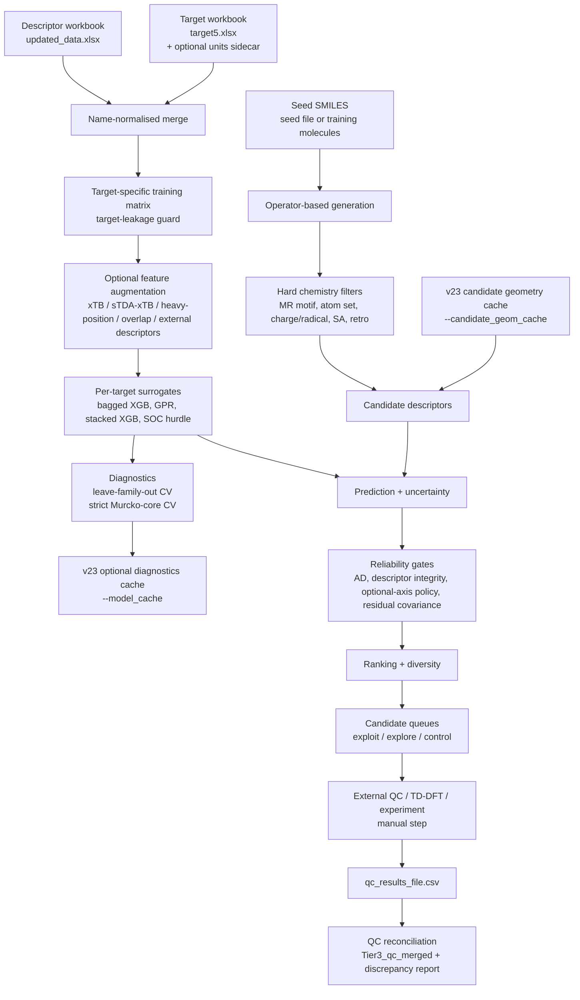
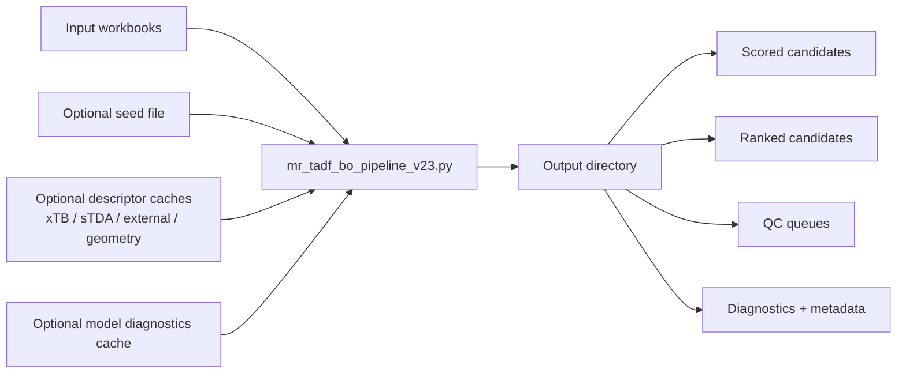
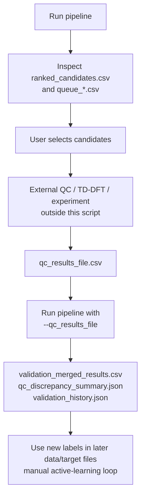

# MR-TADF Adaptive Inverse Design — v23

> Operator-based inverse-design workflow for **multi-resonance thermally activated delayed fluorescence (MR-TADF)** candidates, with target-specific surrogate modelling, reliability-gated ranking, descriptor-consistency controls, and an explicitly manual external validation loop.


---

## Summary

This repository contains a command-line research pipeline, `mr_tadf_bo_pipeline_v23.py`, for proposing and prioritising MR-TADF candidate molecules.

The pipeline:

1. loads descriptor and target workbooks;
2. trains independent surrogate models for multiple photophysical targets;
3. generates chemically constrained structural variants from seed molecules;
4. applies hard chemistry, applicability-domain, descriptor-integrity, and reliability gates;
5. ranks candidates under selectable acquisition objectives;
6. writes candidate shortlists and QC queues for external validation;
7. optionally merges user-supplied QC results from later validation rounds;
8. in v23, can reuse expensive CV diagnostics through a model-cache key and share generated-candidate 3D geometries across optional descriptor blocks.

The script is best understood as a **proposal and prioritisation engine**, not an automated validation system. It does **not** run DFT, TD-DFT, ORCA, Gaussian, or experiments internally. Optional xTB/sTDA descriptor paths may run lightweight external executables for feature generation, but final validation remains external and manual.

---

## What changed in v23

v23 keeps the v18–v22 operator-based design philosophy and adds two engineering improvements aimed at faster repeated inverse-design sweeps:

| v23 addition | Implemented behavior |
|---|---|
| `--model_cache` | Caches expensive leave-scaffold-family-out and strict Murcko-core CV diagnostics. The cache is keyed on input-file content and model-defining options so generation/ranking sweeps can skip recomputing CV when the trained-model definition is unchanged. |
| `--refresh_model_cache` | Ignores and overwrites an existing diagnostics cache. Use after changing training/CV code or when forcing a fresh diagnostic run. |
| `--candidate_geom_cache` | Stores a shared generated-candidate 3D geometry so xTB, sTDA-xTB, and overlap descriptor blocks can reuse the same ETKDG/MMFF and optional GFN2-xTB-relaxed geometry rather than re-embedding the same molecule in each block. |

Version-string caveat: the uploaded v23 filename and code comments include v23 functionality, but several internal strings still say `v21`, and many carried-forward comments refer to v22. This README treats the supplied script as the **v23 pipeline file**, while noting that internal metadata harmonisation is still recommended.

---

## Why this repository exists

MR-TADF molecular design is challenging because useful candidates occupy a narrow and highly constrained region of chemical space:

- small or controlled `DeltaEST`;
- singlet energies in an application-relevant window;
- adequate oscillator strength;
- favourable `T2-T1` energetics;
- spin-orbit-coupling behavior that is sparse, heavy-tailed, and strongly chemistry-dependent;
- retained MR topology and synthetic plausibility;
- predictions that remain inside a defensible applicability domain.

The pipeline therefore avoids treating surrogate predictions as validation. It proposes candidates, scores them with reliability information, and exports queues for the user to validate externally through quantum chemistry or experiment.

---

## Graphical abstract



---

## Repository scope

### Implemented in `mr_tadf_bo_pipeline_v23.py`

| Capability | Implemented? | Notes |
|---|---:|---|
| Excel descriptor/target loading | Yes | Uses `Name`-based merge after normalisation and duplicate checks. |
| Target leakage guard | Yes | Drops descriptor columns that resemble target columns before model training. |
| Independent per-target modelling | Yes | Each target uses finite labels for that target; complete-case labels are not required. |
| Candidate generation | Yes | Operator-based molecular edits with chemistry-aware permissions and hard filters. |
| Deep generative VAE/flow/diffusion/RL | No | Removed in v18. Optional `torch`/`selfies` imports remain guarded and should not be required for the operator-only path. |
| RDKit/base descriptor serving | Yes | Internal candidate descriptor fallback uses RDKit descriptors and fingerprint-style columns where possible. |
| External candidate descriptor path | Yes, default on | v22.x path attempts to use a robust Mordred/RDKit/PaDEL descriptor-generation workflow for candidates, or a precomputed external candidate descriptor table. |
| Heavy-atom-position descriptors | Yes, default on | SMILES-only descriptors for heavy-atom counts and positions, used especially for SOC-related modelling. |
| xTB descriptor augmentation | Optional | Requires companion code and an `xtb` executable. |
| sTDA-xTB descriptor augmentation | Optional | Requires `xtb4stda`, `stda`, and parser support. |
| Overlap / charge-transfer proxy descriptors | Optional | Requires MOLDEN/xTB-related workflow; intended as screening descriptors, not rigorous population analysis. |
| Bagged XGBoost surrogates | Yes | Default model family. |
| Gaussian-process surrogate | Optional | Enabled with `--use_gpr`; not used simultaneously with stacking. |
| Stacked XGB + Ridge surrogate | Optional | Enabled with `--enable_stacking`; mainly for non-SOC targets. |
| SOC hurdle model | Yes, default on | Classifier for active SOC multiplied by active-subset regressor. |
| SOC asinh transform | Yes, default on | Predictions are inverse-transformed back to linear SOC units. |
| Conformal sigma calibration | Optional | Diagnostic marginal calibration; does not create formal coverage guarantees for selected top candidates. |
| Leave-scaffold-family-out CV | Yes | Headline OOF diagnostic; v23 can cache the resulting diagnostics. |
| Strict leave-one-Murcko-core-out CV | Yes | Includes singleton cores when configured with minimum test size of 1. |
| Residual covariance | Optional | Uses out-of-fold residuals when enabled. |
| Candidate queues | Yes | Exploit, explore, and control queues are written when candidates remain after scoring/ranking. |
| External QC reconciliation | Optional | Merges QC CSV by canonical SMILES. |
| Automated DFT/TD-DFT validation | No | Explicitly external/manual. |

---

## Combined workflow concept

The pipeline is a single Python script with a large `main()` function and many supporting utilities. It is not a package, web service, notebook, or workflow-manager project.



---

## Code-to-README validation note

This README is derived from direct inspection of the supplied `mr_tadf_bo_pipeline_v23.py` file and the repository README that previously described the v22 workflow.

The description is intentionally conservative:

- surrogate predictions are described as predictions, not validation;
- external QC/DFT/experiment are described as manual steps;
- optional descriptor blocks are described as optional and dependency-dependent;
- xTB/sTDA/overlap features are not claimed to be rigorous quantum validation;
- v23 caches are described as reuse mechanisms, not changes to the scientific objective;
- internal version-string inconsistencies are documented rather than hidden.

---

## Software environment

### Required Python libraries for the baseline script

| Package | Used for |
|---|---|
| `numpy` | Numerical arrays, sampling, linear algebra, finite-value checks. |
| `pandas` | Excel/CSV I/O and tabular outputs. |
| `scipy` | Normal CDF and Spearman correlation. |
| `rdkit` | Molecule parsing, fingerprints, descriptors, scaffolds, chemistry edits. |
| `scikit-learn` | CV, preprocessing, imputation, metrics, GPR, nearest-neighbour AD scoring. |
| `xgboost` | Default regression/classification surrogate models. |
| `matplotlib` | Diagnostic plots. |
| `openpyxl` | Practical requirement for `.xlsx` reading/writing through pandas. |

### Optional Python libraries

| Package | Status |
|---|---|
| `torch` | Imported inside a guarded optional block. Deep generative modules were removed in v18, so absence should not block baseline operator generation. |
| `selfies` | Imported inside a guarded optional block. No longer central after removal of the deep generative stack. |
| `psutil` | Optional helper for physical CPU-core detection; the script has fallbacks. |

### Optional companion modules

These are repository-side or adjacent `.py` files expected only when the corresponding optional workflow is enabled.

| Module | Needed when |
|---|---|
| `xtb_descriptors.py` | `--use_xtb_descriptors` or candidate xTB descriptor serving. |
| `descriptor_provenance.py` | Verifying descriptor CSV manifests for optional descriptor blocks. |
| `parse_stda_xtb_important_descriptors.py` | `--use_stda_descriptors`. |
| `stda_overlap.py` | `--use_overlap_descriptors`. |
| `robust_descriptor_pipeline_1.py` or equivalent descriptor-generation script | Default-on external candidate descriptor path when generating Mordred/RDKit/PaDEL candidate descriptors on the fly. |

### Optional external executables

| Executable | Used by |
|---|---|
| `xtb` | xTB descriptors, optional candidate geometry relaxation, overlap descriptor path. |
| `xtb4stda` | sTDA-xTB candidate descriptor workflow. |
| `stda` | sTDA excited-state descriptor workflow. |
| Java | Needed by PaDEL if the external descriptor-generation workflow invokes PaDEL. |

### Example conda environment

```bash
conda create -n mr-tadf-v23 python=3.10 -c conda-forge \
  rdkit numpy pandas scipy scikit-learn xgboost matplotlib openpyxl

conda activate mr-tadf-v23
```

Optional:

```bash
pip install torch selfies psutil
```

For optional xTB/sTDA/PaDEL workflows, install the corresponding external executables separately and ensure they are discoverable through `PATH` or the relevant command-line flags.

---

## Input data contract

### Descriptor table: `--data`

Default:

```text
updated_data.xlsx
```

The script treats the first descriptor workbook column as `Name` and the second as `SMILES`. Remaining non-target-like columns are treated as descriptors after leakage filtering.

Expected shape:

| Name | SMILES | descriptor_1 | descriptor_2 | ... |
|---|---|---:|---:|---:|
| Molecule_A | `...` | ... | ... | ... |
| Molecule_B | `...` | ... | ... | ... |

### Target table: `--target`

Default:

```text
target5.xlsx
```

The script expects any of the following target columns:

| Target column | Meaning in pipeline | Unit role |
|---|---|---|
| `DeltaEST` | Singlet-triplet energy gap | energy |
| `T2-T1` | Triplet-triplet gap | energy |
| `T1-S1(SOC)` | T1/S1 spin-orbit coupling | SOC |
| `T2-S1(SOC)` | T2/S1 spin-orbit coupling | SOC |
| `Oscillator Strengths` | Oscillator strength | dimensionless |
| `Singlets` | Singlet energy | energy |

Rows are retained if at least one target is present. Each target model trains on its own finite-label subset.

### Unit sidecar

By default, labelled target, QC, and benchmark files require a hash-bound units sidecar:

```text
target5.xlsx.units.json
```

Example:

```json
{
  "schema": "mr_tadf_external_units_v1",
  "data_file": {
    "sha256": "<sha256-of-target5.xlsx>"
  },
  "columns": {
    "DeltaEST": "eV",
    "T2-T1": "eV",
    "Singlets": "eV",
    "T1-S1(SOC)": "cm-1",
    "T2-S1(SOC)": "cm-1",
    "Oscillator Strengths": "dimensionless"
  }
}
```

For legacy data without sidecars, use:

```bash
--allow_missing_unit_contract
```

A present but stale or contradictory sidecar should be treated as an error condition, not a warning.

---

## Quick start

### Minimal operator-only run

```bash
python mr_tadf_bo_pipeline_v23.py \
  --data updated_data.xlsx \
  --target target5.xlsx \
  --output results/basic
```

For legacy data without unit sidecars:

```bash
python mr_tadf_bo_pipeline_v23.py \
  --data updated_data.xlsx \
  --target target5.xlsx \
  --output results/basic_legacy \
  --allow_missing_unit_contract
```

### Run with a separate seed list

```bash
python mr_tadf_bo_pipeline_v23.py \
  --data updated_data.xlsx \
  --target target5.xlsx \
  --seed_file seeds.txt \
  --n_candidates 10000 \
  --output results/seeded
```

A `.txt` seed file should contain one SMILES per line. An `.xlsx` seed file is also accepted; the script reads the second column when present, otherwise the first.

### v23: repeated ranking/generation sweeps with cached CV diagnostics

Use this when the training data and model-defining options stay fixed, but you want to sweep generation or ranking settings.

```bash
python mr_tadf_bo_pipeline_v23.py \
  --data updated_data.xlsx \
  --target target5.xlsx \
  --seed_file seeds.txt \
  --n_candidates 10000 \
  --objective adaptive \
  --model_cache cache/model_diagnostics \
  --output results/adaptive_sweep_1
```

Force a fresh diagnostics cache:

```bash
python mr_tadf_bo_pipeline_v23.py \
  --data updated_data.xlsx \
  --target target5.xlsx \
  --model_cache cache/model_diagnostics \
  --refresh_model_cache \
  --output results/adaptive_fresh_cv
```

The cache is for diagnostics reuse. Model fits and conformal calibration are still refit for the run.

### v23: shared generated-candidate geometry cache

Use this when geometry-dependent optional descriptors are enabled:

```bash
python mr_tadf_bo_pipeline_v23.py \
  --data updated_data.xlsx \
  --target target5.xlsx \
  --seed_file seeds.txt \
  --use_xtb_descriptors \
  --use_stda_descriptors \
  --use_overlap_descriptors \
  --candidate_geom_cache candidate_geom_out/geom_cache \
  --output results/with_shared_geometry_cache
```

The cache is keyed by canonical SMILES and geometry settings. Switching optional xTB relaxation settings should create distinct cached geometries rather than mixing geometry levels.

### Publication-oriented run

```bash
python mr_tadf_bo_pipeline_v23.py \
  --data updated_data.xlsx \
  --target target5.xlsx \
  --seed_file seeds.txt \
  --n_candidates 10000 \
  --objective adaptive \
  --calibrate_sigma \
  --scaffold_conformal \
  --enable_residual_cov \
  --model_cache cache/model_diagnostics \
  --validation_history_file validation_history.json \
  --output results/adaptive_round1
```

### Run with xTB and sTDA descriptor augmentation

```bash
python mr_tadf_bo_pipeline_v23.py \
  --data updated_data.xlsx \
  --target target5.xlsx \
  --seed_file seeds.txt \
  --use_xtb_descriptors \
  --xtb_descriptors_file xtb_out/xtb_descriptors.csv \
  --xtb_bin /path/to/xtb \
  --use_stda_descriptors \
  --stda_descriptors_file stda_xtb_important_descriptors.csv \
  --xtb4stda_bin /path/to/xtb4stda \
  --stda_bin /path/to/stda \
  --candidate_geom_cache candidate_geom_out/geom_cache \
  --n_candidates 1000 \
  --output results/with_multifidelity_descriptors
```

This mode is slower because candidate-side descriptors may be computed on the fly and cached.

### Merge external QC results

```bash
python mr_tadf_bo_pipeline_v23.py \
  --data updated_data.xlsx \
  --target target5.xlsx \
  --seed_file seeds.txt \
  --qc_results_file qc_round1.csv \
  --validation_history_file validation_history.json \
  --output results/round1_qc_merged
```

The QC CSV must contain a `smiles` column plus any target columns to merge.

---

## Command-line interface overview

### Core IO and execution

| Option | Default | Description |
|---|---:|---|
| `--data` | `updated_data.xlsx` | Descriptor workbook. |
| `--target` | `target5.xlsx` | Label workbook. |
| `--seed_file` | `None` | Optional seed SMILES file, `.txt` or `.xlsx`. |
| `--benchmark_file` | `None` | Optional benchmark SMILES or labelled benchmark workbook. |
| `--n_candidates` | `10000` | Requested generated candidates. |
| `--n_workers` | `0` | Worker count. `0` auto-selects CPU count with safeguards. |
| `--attempts_per_worker` | `500000` | Maximum edit attempts per worker. |
| `--n_ensemble` | `20` | Deployed bag size for ensemble surrogates. |
| `--output` | `results` | Output directory. |
| `--model_cache` | `None` | v23 diagnostics-cache directory. |
| `--refresh_model_cache` | `False` | Recompute and overwrite cached CV diagnostics. |
| `--max_train_threads` | `0` | Training-thread cap. |

### Generation and chemical space

| Option | Default | Description |
|---|---:|---|
| `--exploratory` | `False` | Enables exploratory atom substitutions and exploratory allowed atoms. |
| `--min_core_sim_parent` | `0.70` | Minimum parent-core similarity. |
| `--min_core_sim_train` | `0.60` | Minimum training-core similarity. |
| `--max_whole_sim_train` | `0.95` | Maximum whole-molecule similarity to training molecules. |
| `--min_heavy_atoms` | `12` | Minimum heavy atoms for candidate acceptance. |
| `--max_heavy_atoms` | `100` | Maximum heavy atoms for candidate acceptance. |
| `--enable_bulky` | `False` | Enables bulky substituent operators. |
| `--enable_diaza` | `False` | Enables paired diaza substitution. |
| `--enable_annulation` | `False` | Enables the plain benzannulation operator. |
| `--novelty_mode` | `balanced` | One of `conservative`, `balanced`, `exploratory`. |

### Ranking and objectives

| Option | Default | Description |
|---|---:|---|
| `--objective` | `adaptive` | One of `adaptive`, `dEST`, `TADF_FoM`, `dEST_fOSC`. |
| `--singlet_min_eV` | `2.0` | Lower adaptive singlet window edge. |
| `--singlet_max_eV` | `3.5` | Upper adaptive singlet window edge. |
| `--adaptive_min_ad` | `0.25` | Minimum AD score before optional adaptive axes influence ranking. |
| `--adaptive_min_core_train` | `2` | Minimum exact-core training rows for optional axes. |
| `--adaptive_min_axis_oof_r2` | `0.0` | Minimum strict-core OOF R² for optional axis activation. |
| `--adaptive_max_core_mae_factor` | `1.5` | Local-core MAE limit relative to pooled strict-core OOF MAE. |
| `--adaptive_min_core_eval` | `2` | Minimum rows in a held-out exact-core fold. |
| `--adaptive_joint_mc_samples` | `4096` | Monte Carlo samples for correlated adaptive feasibility. |
| `--T2_T1_CONSTRAINT` | `0.40` | T2-T1 feasibility threshold in eV. |
| `--fosc_min` | `0.01` | Minimum oscillator-strength threshold. |
| `--soc1_min` | `0.01` | Minimum T1-S1 SOC threshold in cm⁻¹. |
| `--soc2_min` | `0.05` | Minimum T2-S1 SOC threshold in cm⁻¹. |
| `--gap_max_eV` | `0.5` | Maximum feasible non-inverted `DeltaEST`. |
| `--allow_inverted_singlet` | `False` | Opt into inverted-singlet heuristic ranking. |

### Units

| Option | Default | Allowed values |
|---|---:|---|
| `--energy_units` | `eV` | `eV`, `meV`, `cm-1`, `kcal/mol`, `kJ/mol`, `hartree` |
| `--soc_units` | `cm-1` | `cm-1`, `meV`, `eV`, `hartree` |

### Surrogates and SOC modelling

| Option | Default | Description |
|---|---:|---|
| `--use_gpr` | `False` | Use Gaussian-process surrogate for non-SOC targets. |
| `--gp_alpha` | `0.1` | GPR ridge/noise floor. |
| `--enable_stacking` | `False` | Use XGB bag → Ridge stacked surrogate for non-SOC targets. |
| `--stacking_alpha` | `1.0` | Ridge alpha for stacking. |
| `--cv_n_ensemble` | `8` | Ensemble size inside CV and y-scramble diagnostics. |
| `--soc_hurdle` | `True` | Use two-stage SOC classifier × regressor. |
| `--no_soc_hurdle` | — | Disable SOC hurdle model. |
| `--soc_active_threshold` | `0.5` | Active SOC threshold in cm⁻¹. |
| `--asinh_soc` | `True` | Use asinh transform for SOC targets. |
| `--no_asinh_soc` | — | Disable SOC asinh transform. |
| `--soc_xgb` | `True` | Force SOC targets to bagged XGB even when non-SOC targets use GPR/stacking. |
| `--no_soc_xgb` | — | Let SOC follow the same surrogate family when hurdle is off. |
| `--use_heavy_pos` | `True` | Add heavy-atom-position descriptors. |
| `--no_heavy_pos` | — | Disable heavy-position descriptor block. |

### Descriptor augmentation and descriptor serving

| Option | Default | Description |
|---|---:|---|
| `--use_external_descriptors` | `True` | Default-on external candidate descriptor path for Mordred/RDKit/PaDEL-style descriptors. |
| `--no_use_external_descriptors` | — | Disable external descriptor path and use internal `comp_desc()` fallback. |
| `--external_descriptor_file` | `None` | Precomputed candidate descriptor table. |
| `--descriptor_gen_script` | `None` | Path to robust descriptor-generation script exposing `run_pipeline`. |
| `--external_descriptor_out` | `None` | Candidate external descriptor CSV output path; default is inside output directory. |
| `--external_padel_batch` | `25` | PaDEL micro-batch size forwarded to descriptor generation. |
| `--external_descriptor_fill` | `0.0` | Fill value for missing/non-finite external descriptor cells before model imputation. |
| `--use_xtb_descriptors` | `False` | Add xTB ground-state descriptor block. |
| `--xtb_descriptors_file` | `xtb_out/xtb_descriptors.csv` | Training-set xTB descriptor CSV. |
| `--xtb_bin` | `None` | xTB executable path. |
| `--xtb_cache` | `xtb_out/xtb_cache_cand` | Candidate xTB descriptor cache. |
| `--use_stda_descriptors` | `False` | Add sTDA-xTB excited-state descriptors. |
| `--stda_descriptors_file` | `stda_xtb_important_descriptors.csv` | Training-set sTDA descriptor CSV. |
| `--stda_cache` | `stda_out/stda_cache_cand` | Candidate sTDA descriptor cache. |
| `--xtb4stda_bin` | `None` | `xtb4stda` executable path. |
| `--stda_bin` | `None` | `stda` executable path. |
| `--stda_ewin` | `10.0` | sTDA energy window in eV. |
| `--stda_timeout` | `600` | Per-molecule sTDA/geometry timeout in seconds. |
| `--use_overlap_descriptors` | `False` | Add overlap / charge-transfer proxy descriptors. |
| `--no_overlap_descriptors` | — | Disable overlap descriptor block. |
| `--overlap_xyz_dir` | `validatedxyz` | Training geometry directory for overlap descriptors. |
| `--overlap_cache` | `overlap_out/overlap_cache` | Overlap descriptor cache. |
| `--candidate_geom_cache` | `candidate_geom_out/geom_cache` | v23 shared generated-candidate geometry cache. |
| `--opt_candidate_geom` | `None` | Force candidate xTB geometry optimisation on. |
| `--no_opt_candidate_geom` | — | Force candidate geometry optimisation off. |
| `--min_descriptor_success` | `0.5` | Descriptor-block success threshold. |
| `--strict_descriptors` | `False` | Abort if enabled descriptor blocks fall below the success threshold. |
| `--allow_unverified_descriptor_csv` | `False` | Legacy opt-out for missing descriptor manifests. |

### Validation, diagnostics, queues, and data integrity

| Option | Default | Description |
|---|---:|---|
| `--calibrate_sigma` | `False` | Enable conformal sigma calibration. |
| `--scaffold_conformal` | `False` | Add scaffold-aware conformal kappa. |
| `--scaffold_cv` | `False` | CLI flag retained; current main path writes CV reports. |
| `--core_split_cv_min_test` | `1` | Minimum held-out Murcko-core fold size. |
| `--y_scramble_n` | `1` | Number of y-scramble baselines in leave-family-out CV. |
| `--enable_residual_cov` | `False` | Compute out-of-fold residual covariance. |
| `--benchmark_file` | `None` | Optional benchmark prediction/evaluation file. |
| `--qc_results_file` | `None` | Optional QC CSV for reconciliation. |
| `--validation_history_file` | `None` | Persistent cross-run validation-history JSON; defaults inside output directory. |
| `--label_source_col` | `None` | Target-file label-source column. |
| `--label_source_weights` | `None` | JSON mapping from label source to sample weight. |
| `--duplicate_conflict_policy` | `error` | One of `error`, `first`. |
| `--allow_missing_unit_contract` | `False` | Legacy opt-out for missing target/QC/benchmark units sidecars. |
| `--ad_hard_threshold` | `0.15` | Hard AD rejection threshold. |
| `--ad_soft_threshold` | `0.40` | Soft-band trust penalty threshold. |
| `--diversity_lambda` | `0.3` | Diversity-selection weighting. |
| `--top_diverse_n` | `50` | Number of diverse candidates selected. |
| `--max_per_parent` | `10` | Max diverse shortlist entries per parent. |
| `--max_per_scaffold_family` | `30` | Max diverse shortlist entries per scaffold family. |
| `--n_exploit` | `30` | Exploitation queue size. |
| `--n_explore` | `30` | Exploration queue size. |
| `--n_control` | `20` | Control queue size. |
| `--sascore_max` | `6.0` | Corpus-relative synthetic-accessibility heuristic cap. |
| `--disable_sa_filter` | `False` | Disable accessibility heuristic. |
| `--disable_retro_filter` | `False` | Disable retrosynthesis heuristic. |
| `--disable_charge_radical_filter` | `False` | Disable neutral closed-shell charge/radical filter. |

---

## Candidate generation details

The generator is operator-based. It mutates seed molecules and then applies sanitisation, topology checks, atom filters, applicability-domain gates, and descriptor-integrity logic before ranking.

### Supported scaffold-family labels

| Label | Meaning |
|---|---|
| `BN-MR` | Boron-nitrogen MR family. |
| `BO-MR` | Boron-oxygen MR family. |
| `CARBONYL-MR` | Carbonyl-containing MR family. |
| `SE-MR` | Selenium-containing MR family. |
| `TE-MR` | Tellurium-containing MR family. |
| `PO-MR` | Phosphine oxide MR family. |
| `PS-MR` | Phosphine sulfide MR family. |
| `PSE-MR` | Phosphine selenide MR family. |
| `NO-MR` | Nitrogen-oxygen MR family. |
| `OTHER` | Fallback family. |

### Atom-site roles

| Role | Interpretation |
|---|---|
| `FROZEN` | Protected atom central to MR motif/topology. |
| `NODE_SAFE` | Safer edit site, often non-frontier carbon. |
| `HOMO` | Near donor/HOMO region. |
| `LUMO` | Near acceptor/LUMO region. |
| `OVERLAP` | Near donor and acceptor regions; generally protected. |
| `STERIC` | Peripheral site where steric edits may be permitted. |
| `PERIM` | Perimeter expansion site. |
| `MODERATE` | Intermediate-risk site. |
| `FORBIDDEN` | Out-of-scope site. |

### Edit operators

The code contains operator families for fluorination, methylation, aza/chalcogen substitution, diaza edits, bulky substitution, donor grafting, cyano substitution, sulfone oxidation, quaternary bridging, rim-BN/rim-BON extension, phosphorus-chalcogenide insertion, carbonyl/QAO/DiKTa-like annulation, B/O/N fused extension, multi-boron fusion, direct double borylation, spirofluorene/spiro-lock operations, sulfur/chalcogen locks, and chalcogen position scans.

Some operators are gated by flags such as `--enable_bulky`, `--enable_diaza`, `--enable_annulation`, and `--exploratory`.

### Hard-filter defaults

| Filter | Default |
|---|---|
| Allowed atoms | B, C, N, O, F, P, S, Se, Te |
| Exploratory additions | Si, Ge |
| Heavy atom range | 12–100 |
| Minimum aromatic rings | 3 |
| Maximum rotatable bonds | 3 |
| Synthetic-accessibility heuristic cap | 6.0 |
| Charge/radical gate | Rejects non-neutral, charged, radical, or open-shell molecules unless disabled. |
| Retrosynthesis heuristic | Rejects selected cumulenes, polyynes, charged motifs, exotic Se/Te motifs, macrocycles, and similar patterns. |
| MR motif requirement | Candidate must retain MR-relevant topology/classification. |

The synthetic-accessibility score in this script is corpus-relative and inspired by Ertl-Schuffenhauer-style ideas, but it is **not** the canonical published SAscore.

---

## Surrogate modelling details

### Targets

| Internal label | Source column |
|---|---|
| `DeltaEST` | `DeltaEST` |
| `T2-T1` | `T2-T1` |
| `T1-S1(SOC)` | `T1-S1(SOC)` |
| `T2-S1(SOC)` | `T2-S1(SOC)` |
| `OscStr` | `Oscillator Strengths` |
| `Singlets` | `Singlets` |

### Default modelling policy

| Target type | Default model |
|---|---|
| Non-SOC targets | Bagged XGBoost regressor |
| SOC targets | Two-stage SOC hurdle model |
| SOC transform | asinh transform, inverse-transformed for output |
| Candidate prediction units | User-declared `--energy_units` and `--soc_units` |

For SOC targets, the default model estimates:

```text
E[SOC | x] ≈ P(SOC > threshold | x) × E[SOC | active, x]
```

The screening columns for large SOC should be interpreted as model-derived prioritisation signals, not proof of calibrated SOC probability.

---

## Output files

The output directory is controlled by `--output`.

### Primary candidate tables

| File | Meaning |
|---|---|
| `all_scored.csv` | Full scored candidate table, including diagnostics and gate columns. |
| `ranked_candidates.csv` | Ranked candidates after objective-specific hard filters. |
| `top_diverse_candidates.csv` | Diversity-selected shortlist. |
| `top50_candidates.csv` | First 50 ranked candidates. |
| `queue_exploit.csv` | Exploitation queue. |
| `queue_explore.csv` | Exploration queue. |
| `queue_control.csv` | Control queue. |
| `export_validation_queue.csv` | Compact validation-priority table for external QC/experiment. |
| `topology_summary.csv` | Topology and substitution-signature summary for selected candidates. |
| `infeasible_candidates.csv` | Written when property filters reject all candidates or when an infeasible audit is needed. |

### Diagnostics and metadata

| File | Meaning |
|---|---|
| `metadata.json` | Main run metadata. Currently may report internal version as `v21`; see version caveat. |
| `publication_diagnostics.json` | Summary suitable for manuscript-supporting diagnostics. |
| `reproducibility_manifest.json` | Input/source/executable manifest. |
| `scaffold_stratified_cv.json` | Leave-scaffold-family-out CV report. |
| `core_split_cv.json` | Strict leave-one-Murcko-core-out CV report. |
| `adaptive_axis_training_only_core_cv.json` | Training-partition optional-axis reliability report when needed. |
| `conformal_kappa.json` | Scalar conformal sigma calibration if enabled. |
| `conformal_kappa_by_scaffold.json` | Scaffold-aware conformal calibration if enabled. |
| `conformal_support.json` | Calibration support summary. |
| `residual_covariance.json` | Out-of-fold residual covariance if enabled. |
| `uncertainty_error_correlation.json` | OOF uncertainty/error correlation report. |
| `feature_importance_summary.json` | Feature-importance summary when interpretability succeeds. |
| `novelty_vs_AD.png` | Diagnostic plot. |
| `parent_core_vs_score.png` | Diagnostic plot. |
| `scaffold_family_barplot.png` | Shortlist scaffold-family plot. |

### Validation feedback outputs

| File | Meaning |
|---|---|
| `validation_merged_results.csv` | Candidate shortlist merged with user-supplied QC labels when available. |
| `qc_discrepancy_summary.json` | QC-vs-surrogate discrepancy summary. |
| `validation_history.json` | Persistent active-learning history if no external path is supplied. |
| `benchmark_predictions.csv` | Benchmark predictions if `--benchmark_file` is supplied. |
| `benchmark_metrics.json` | Benchmark metrics when benchmark labels are available. |

### Cache outputs

| Cache | Meaning |
|---|---|
| `--model_cache` directory | v23 cache for CV diagnostics keyed on data and model-defining options. |
| `candidate_geom_out/geom_cache` | v23 default shared candidate-geometry cache. |
| `xtb_out/xtb_cache_cand` | Candidate xTB descriptor cache. |
| `stda_out/stda_cache_cand` | Candidate sTDA descriptor cache. |
| `overlap_out/overlap_cache` | Overlap descriptor cache. |
| external descriptor output | Defaults to `<output>/candidate_external_descriptors.csv` when generated. |

---

## External-manual validation loop

The pipeline implements validation bookkeeping, not validation itself.



Validation tiers used by the workflow include:

| Tier | Meaning |
|---|---|
| `Tier1_surrogate` | Candidate has surrogate predictions only. |
| `Tier2_qc_requested` | Candidate was requested for QC but has no matched QC result in the supplied file. |
| `Tier3_qc_merged` | Candidate has matched external QC labels merged back into the shortlist. |

---

## Reproducibility notes

The script writes a `reproducibility_manifest.json` with input-file and source-file information. This is useful, but it is not a substitute for a fully pinned software environment.

For publication use, record at least:

- exact repository commit hash;
- exact `mr_tadf_bo_pipeline_v23.py` hash;
- Python version;
- RDKit, scikit-learn, XGBoost, NumPy, SciPy, pandas, and matplotlib versions;
- optional xTB/sTDA executable versions and paths;
- descriptor-generation script version if external Mordred/RDKit/PaDEL descriptors are used;
- target units sidecar files;
- cache settings, especially `--model_cache`, `--candidate_geom_cache`, and descriptor caches.

The v23 model diagnostics cache is keyed to avoid stale reuse under model-defining changes, but users should still refresh the cache after code modifications that are not reflected in the key.

---

## Methodological contribution

The pipeline’s contribution is a practical inverse-design workflow for MR-TADF proposal generation, not a new quantum-chemical validation method.

Methodologically, it combines:

- chemically constrained operator-based edits;
- MR-topology and scaffold-family awareness;
- synthetic-accessibility and retrosynthetic plausibility heuristics;
- independent target-specific surrogate models;
- SOC-specific transforms and hurdle modelling;
- leave-family-out and strict Murcko-core diagnostics;
- applicability-domain gates;
- optional out-of-fold residual covariance for correlated uncertainty;
- descriptor-integrity checks for optional feature blocks;
- candidate queues for manual external validation;
- v23 cache mechanisms for repeated research sweeps.

---

## Suggested repository layout

```text
.
├── README.md
├── mr_tadf_bo_pipeline_v23.py
├── updated_data.xlsx
├── target5.xlsx
├── target5.xlsx.units.json
├── seeds.txt
├── results/
│   └── ...
├── cache/
│   └── model_diagnostics/
├── candidate_geom_out/
│   └── geom_cache/
├── xtb_out/
│   ├── xtb_descriptors.csv
│   └── xtb_cache_cand/
├── stda_out/
│   └── stda_cache_cand/
├── overlap_out/
│   └── overlap_cache/
└── descriptor_generation/
    └── robust_descriptor_pipeline_1.py
```

Only the main script and input workbooks are required for the simplest baseline run. Optional descriptor workflows require their own files and executables.

---

## Recommended additions for publication readiness

- Add a `LICENSE`.
- Add `environment.yml` or `requirements.txt`.
- Add a small smoke-test input dataset.
- Add a short `tests/` directory for CLI smoke tests and cache-key behavior.
- Harmonise internal version strings from `v21` to `v23`.
- Include unit sidecar examples for target, QC, and benchmark files.
- Document the exact descriptor-generation repository/script used for external candidate descriptors.
- Add CI for linting or minimal import/argument parsing.
- Archive a release through Zenodo or similar if linked from a manuscript.

---

## Limitations

- The pipeline produces surrogate-guided candidate proposals, not validated emitters.
- No DFT, TD-DFT, ORCA, Gaussian, or experimental validation is launched by the script.
- Optional xTB/sTDA/overlap descriptors are feature-generation or screening tools, not final validation.
- Several internal version strings still report older versions despite v23 features.
- External descriptor generation depends on companion code and executables outside the baseline script.
- The external descriptor path falls back to internal descriptors if the external script or required runtime is unavailable.
- Conformal sigma calibration is diagnostic and marginal; selected top candidates do not receive a formal coverage guarantee.
- Cache reuse accelerates repeated sweeps but should be refreshed after code changes that may alter diagnostics.
- The corpus-relative synthetic-accessibility heuristic should not be interpreted as the canonical SAscore or as an absolute synthetic feasibility metric.
- The quality of surrogate predictions depends strongly on training-data coverage, descriptor consistency, target units, and applicability-domain support.

---

## Example citation block

```bibtex
@software{inverse_design_mrtadf_v23,
  title        = {MR-TADF Adaptive Inverse Design Pipeline},
  author       = {Your Name and Contributors},
  year         = {2026},
  version      = {v23},
  url          = {https://github.com/ph7klw76/InverseDesignMRTADF},
  note         = {Operator-based MR-TADF candidate proposal workflow with reliability-gated surrogate ranking and external-manual validation feedback}
}
```

Please also cite RDKit, XGBoost, scikit-learn, xTB/sTDA tools, PaDEL, Mordred, and any descriptor-generation dependencies used in your specific workflow.

---

## Maintainer note

For the v23 repository update, make sure the repository contains `mr_tadf_bo_pipeline_v23.py` and that command examples in this README match the committed filename. Before publication, harmonise `metadata.json`, `publication_diagnostics.json`, the module docstring, and the `argparse` description so they report v23 consistently.
