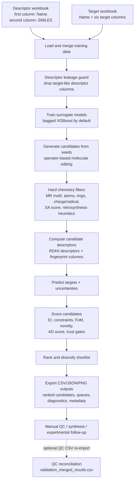
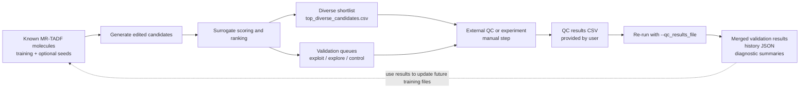

# MR-TADF Pipeline v18

**Operator-guided candidate generation, surrogate ranking, and validation-queue construction for multi-resonance TADF molecular design**

[](#suggested-software-environment)
[](#suggested-software-environment)
[](#surrogate-models)
[](#suggested-software-environment)
[](#repository-scope)
[](#repository-scope)
[](#recommended-additions-for-publication-readiness)

---

## Repository summary

This repository contains a single research pipeline, `mr_tadf_bo_pipeline_v18.py`, for **in silico prioritization of multi-resonance thermally activated delayed fluorescence (MR-TADF) candidate molecules**.

The script combines:

- chemistry-aware **operator-based molecular editing** from seed SMILES;
- RDKit-based structural filtering and descriptor calculation;
- surrogate prediction of MR-TADF-relevant targets;
- constrained Bayesian-optimization-style acquisition;
- novelty, applicability-domain, and trust gating;
- diversity-aware shortlist selection;
- export of validation queues for downstream quantum-chemistry or experimental follow-up.

The pipeline is intended as a **publication companion workflow** for candidate prioritization. It does **not** run quantum chemistry, does **not** perform synthesis planning, and does **not** experimentally validate candidates. Validation is handled by exported CSV files and optional re-import of external QC results.

---

## Why this repository exists

MR-TADF design requires balancing several coupled objectives: small singlet-triplet gap, favorable triplet-state ordering, sufficient oscillator strength, spin-orbit coupling, structural novelty, and chemical plausibility.

`mr_tadf_bo_pipeline_v18.py` implements a practical candidate-prioritization workflow that:

1. starts from known MR-TADF-like seed structures;
2. proposes chemically constrained structural edits;
3. filters candidates using MR-motif, charge/radical, synthetic-accessibility, and retrosynthesis heuristics;
4. predicts photophysical targets using learned surrogate models;
5. ranks candidates with acquisition, novelty, trust, and applicability-domain terms;
6. exports shortlists and queues for next-round validation.

The implemented workflow is best interpreted as a **decision-support and active-learning triage tool**, not as a replacement for high-level electronic-structure calculations or laboratory validation.

---

## Graphical abstract / workflow diagram



---

## Repository scope

### Implemented in the code

The uploaded code implements a **single command-line pipeline**:

| File | Role |
|---|---|
| `mr_tadf_bo_pipeline_v18.py` | Main pipeline for loading training data, training surrogates, generating candidates, scoring/ranking, diversity selection, validation-queue export, optional benchmark prediction, optional QC merge, and diagnostic reporting. |

The script includes the following implemented components:

- training-data loading from Excel workbooks;
- descriptor leakage guard before training-data merge;
- scaffold-family and MR-core detection;
- atom/site role labeling for edit permissions;
- operator-based molecular mutation;
- hard structural filters;
- synthetic-accessibility scoring fitted to the supplied corpus;
- heuristic retrosynthetic-feasibility rejection;
- neutral closed-shell charge/radical gate;
- bagged-XGBoost surrogate ensembles;
- optional Gaussian-process surrogate mode;
- optional stacked XGB-to-ridge surrogate mode;
- uncertainty scaling through conformal calibration;
- scaffold-family and Murcko-core cross-validation reports;
- residual covariance estimation for multi-target FoM sampling;
- novelty, trust, and applicability-domain scoring;
- queue generation for exploitation, exploration, and control candidates;
- optional benchmark prediction;
- optional QC-result reconciliation;
- active-learning validation-history logging;
- feature-importance reports for tree-based surrogates.

### Not implemented

The code does **not** implement:

- quantum-chemistry calculations;
- TDDFT input generation;
- ORCA, Gaussian, Q-Chem, or similar execution;
- synthesis route planning;
- reaction enumeration with guaranteed synthetic feasibility;
- experimental validation;
- a package API;
- a web interface;
- deep generative molecular generation in v18.

The file header states that v18 removes the earlier VAE / normalizing-flow / diffusion / reinforcement-learning generative stack. Optional `torch` and `selfies` imports remain guarded by `try/except`, but the active candidate pool in v18 is operator-generated.

---

## Code-to-README validation note

This README is derived from static inspection of `mr_tadf_bo_pipeline_v18.py`. Claims are restricted to behavior visible in the code. In particular:

- the workflow is a **single-script CLI**, not a multi-module package;
- the QC loop is **manual file handoff**, not automatic quantum-chemistry orchestration;
- validation utilities summarize predictions and optional user-supplied QC labels, but do not constitute independent physical validation;
- some internal metadata strings still report legacy labels such as `v16` or `v16.1`, even though the file header identifies the script as v18.

---

## Combined workflow concept

The intended workflow is an iterative active-learning loop:



The code supports this loop through exported CSV files and optional re-import of QC results. Updating the training dataset itself remains a manual repository/user workflow.

---

## Highlights

- **MR-TADF-specific chemistry constraints**  
  Candidate filters require MR-relevant motifs such as B, carbonyl, Se, Te, or P-chalcogenide motifs, plus heteroatom donors and ring-system constraints.

- **Operator-based candidate generation**  
  The generator applies targeted molecular edits rather than unconstrained SMILES sampling.

- **Multi-target surrogate scoring**  
  Six targets are modeled: `DeltaEST`, `T2-T1`, `T1-S1(SOC)`, `T2-S1(SOC)`, `Oscillator Strengths`, and `Singlets`.

- **TADF figure-of-merit objective**  
  The default objective is a scalarized log-scale FoM using oscillator strength, effective SOC, and ΔE_ST.

- **Applicability-domain gating**  
  Candidates receive descriptor/fingerprint/uncertainty-based AD scores, with hard and soft thresholds.

- **Diversity-aware shortlist selection**  
  The final shortlist balances quality with whole-molecule distance, core distance, substitution-topology distance, property distance, and core-topology distance.

- **Publication-facing outputs**  
  The script writes ranked candidates, validation queues, topology summaries, metadata, JSON diagnostics, plots, and feature-importance reports.

---

## Input data requirements

### Descriptor workbook: `--data`

Default:

```bash
updated_data.xlsx
```

Expected structure:

| Position | Meaning |
|---|---|
| first column | molecule identifier, renamed internally to `Name` |
| second column | SMILES string, renamed internally to `SMILES` |
| remaining columns | descriptor columns used as model features |

The descriptor table is merged with the target table on `Name`.

The loader contains a descriptor leakage guard: descriptor columns with names matching or resembling target labels are dropped before merging.

### Target workbook: `--target`

Default:

```bash
target5.xlsx
```

Expected target columns:

```text
DeltaEST
T2-T1
T1-S1(SOC)
T2-S1(SOC)
Oscillator Strengths
Singlets
```

Rows with missing target values after numeric coercion are removed.

Energy-like columns are interpreted according to `--energy_units`; SOC columns are interpreted according to `--soc_units`.

### Optional seed file: `--seed_file`

Accepted formats:

- `.txt`: one SMILES per non-empty line;
- `.xlsx`: second column is used if present, otherwise the first column.

If `--seed_file` is omitted, the training SMILES are used as seeds.

### Optional benchmark file: `--benchmark_file`

Accepted formats:

- `.txt`: one benchmark SMILES per line;
- `.xlsx`: second column is used if present, otherwise the first column.

If the Excel file contains target columns, the script attempts to compute benchmark metrics.

### Optional QC results file: `--qc_results_file`

Expected format:

```text
smiles,<one or more QC target/result columns>
```

The QC file is matched to shortlisted candidates by canonicalized SMILES and written into `validation_merged_results.csv`.

---

## Script components

| Component | Implemented behavior |
|---|---|
| Data loading | Reads descriptor and target Excel files, merges on `Name`, blocks target-like descriptor leakage, imputes missing descriptor values with medians. |
| Scaffold detection | Identifies MR-relevant scaffold families including BN-MR, BO-MR, carbonyl-MR, Se-MR, Te-MR, P=O/P=S/P=Se MR, NO-MR, and OTHER. |
| Site labeling | Assigns atom roles such as frozen, HOMO, LUMO, overlap, perimeter, moderate, and forbidden to control edit permissions. |
| Candidate generation | Uses RDKit editable molecules and weighted mutation operators to generate candidates from seed structures. |
| Hard filtering | Rejects invalid atoms, missing MR motifs, excessive rotatable bonds, inadequate aromatic ring count, charged/radical species, heuristic retrosynthetic red flags, and high SA-score candidates. |
| Descriptor calculation | Reconstructs candidate descriptor vectors from the descriptor names used in the training workbook, including RDKit descriptors and fingerprint-derived columns. |
| Surrogate modeling | Trains one model family per target using bagged XGBoost by default, with optional GPR or stacked XGB + ridge mode. |
| Scoring | Computes EI-style acquisition, feasibility terms, novelty, MR quality, AD score, trust penalties, and final normalized score. |
| Ranking | Applies uncertainty, ΔE_ST, T2-T1, and trust filters before sorting by `final_score`. |
| Diversity selection | Selects a capped diverse subset using multi-view molecular, core, topology, and property distances. |
| Queue construction | Produces exploitation, exploration, and control queues for next-round validation. |
| Diagnostics | Writes CV reports, uncertainty-error correlation, plots, metadata, topology summaries, and optional QC/benchmark summaries. |

---

## Candidate-generation operators

The candidate generator is operator-based. Depending on CLI flags and available molecular sites, it may apply:

| Operator family | Description |
|---|---|
| `F` | fluorination of allowed aromatic C-H sites |
| `paired_F` | symmetry-paired fluorination |
| `CH3` | methyl substitution |
| `paired_CH3` | symmetry-paired methyl substitution |
| `aza` | aromatic atom substitution according to allowed family/site rules |
| `F+aza` | combined fluorination and aza substitution |
| `diaza` | optional paired aza substitution, enabled by `--enable_diaza` |
| `tBu` | optional tert-butyl substitution, enabled by `--enable_bulky` |
| `annul` | optional benzannulation, enabled by `--enable_annulation` |
| `graft_D[...]` | donor grafting from an internal donor library |
| `CN` | cyano substitution |
| `SO2` | sulfone oxidation of aromatic sulfur sites |
| `q4_bridge` | sp³ bridge insertion across suitable biaryl single bonds |
| `rim_BN` | ν-DABNA-style B/N rim extension across selected perimeter edges |
| `P_insert[P=O/S/Se]` | P-chalcogenide insertion across suitable biaryl single bonds |

The donor library includes carbazole-like, diphenylamine-like, phenoxazine/phenothiazine-like, and dibenzofuran/dibenzothiophene/dibenzoselenophene-like fragments.

---

## Hard filters and decision logic

The hard filter accepts molecules only if they satisfy the implemented structural constraints.

### Default atom set

Default allowed atomic numbers correspond to:

```text
B, C, N, O, F, P, S, Se, Te
```

With `--exploratory`, Si and Ge are additionally allowed.

### Required structural criteria

A candidate must satisfy, among other checks:

- at least one MR-defining motif:
  - aromatic boron;
  - aromatic carbonyl;
  - aromatic selenium;
  - aromatic tellurium;
  - tetracoordinate P=O, P=S, or P=Se;
- at least one N/O/S/Se/Te heteroatom;
- at least three aromatic rings;
- heavy atom count in the configured range;
- bounded rotatable-bond count, relaxed slightly for donor-grafted molecules;
- valid MR core detection;
- neutral closed-shell form unless the charge/radical filter is disabled;
- no heuristic retrosynthesis red flags unless disabled;
- SAscore below `--sascore_max` unless disabled.

### Synthetic-accessibility gate

The script defines an Ertl-Schuffenhauer-style SAscore implementation. Instead of using a bundled large external reference corpus, it fits fragment frequencies from the supplied training and seed molecules at runtime. This makes the score self-consistent with the input corpus, but it should be interpreted as a **corpus-relative heuristic**, not a universal synthetic-accessibility metric.

### Retrosynthesis gate

The retrosynthesis filter rejects selected SMARTS patterns and ring/topology cases considered unlikely under routine MR-TADF synthetic logic. This is a heuristic filter, not a retrosynthetic planner.

---

## Surrogate models

The default surrogate is a bagged XGBoost ensemble trained separately for each target.

### Default mode

```text
bagged XGBoost
```

For each target, the code trains `--n_ensemble` XGBoost models on bootstrapped samples and uses the mean and across-bag standard deviation as prediction and uncertainty.

### Optional Gaussian-process mode

Enabled with:

```bash
--use_gpr
```

This uses a single Gaussian-process regressor with a Matérn-5/2 kernel and white-noise term. The implementation is wrapped to match the mean/std prediction interface used elsewhere in the pipeline.

### Optional stacked mode

Enabled with:

```bash
--enable_stacking
```

This trains the usual XGBoost bag, then fits a ridge meta-learner on the base predictions. The stacked model uses the meta-learner for the mean prediction while retaining across-bag standard deviation as the uncertainty estimate.

### Label-source weighting

The XGBoost paths can apply per-row sample weights from a target-file source column:

```bash
--label_source_col source \
--label_source_weights '{"experimental":2.0,"DFT":1.0}'
```

Gaussian-process mode does not use these weights.

---

## Scoring and ranking logic

The code supports two acquisition objectives.

### `TADF_FoM` objective

Default:

```bash
--objective TADF_FoM
```

The implemented log-scale figure of merit is:

```text
log10(FoM) = log10(fOSC) + 2 log10(SOC_eff) - 2 log10(DeltaEST)
```

where `SOC_eff` is the larger of the predicted T1-S1 and T2-S1 SOC values after unit conversion.

For this nonlinear objective, the code estimates expected improvement using Monte Carlo sampling from surrogate predictive distributions. If `--enable_residual_cov` is supplied, correlated residual noise is sampled using the empirical residual covariance across FoM-contributing targets.

### `dEST` objective

Legacy single-objective mode:

```bash
--objective dEST
```

This computes expected improvement for minimizing `DeltaEST`.

### Feasibility and trust factors

The final score combines acquisition with:

- probability of satisfying the T2-T1 constraint;
- probability of exceeding SOC thresholds;
- probability of exceeding oscillator-strength threshold;
- MR structural quality;
- applicability-domain score;
- parent trust;
- training-set trust;
- novelty boost.

The final ranking also requires:

```text
unc_DeltaEST < 0.10
pred_T2_T1  < 0.40
pred_DeltaEST < 0.20
trust_parent > 0
trust_train  > 0
```

If no candidates pass the main filter, the ranker relaxes to a broader uncertainty filter.

---

## Applicability-domain gating

The AD score combines:

- descriptor-space nearest-neighbor distance;
- whole-molecule fingerprint distance to training molecules;
- core fingerprint distance to training molecules;
- predicted uncertainty.

Candidates with:

```text
AD_score < --ad_hard_threshold
```

are hard-rejected by setting `trust_parent` to zero. Candidates in the soft band:

```text
--ad_hard_threshold <= AD_score < --ad_soft_threshold
```

receive a multiplicative trust penalty.

Default thresholds:

```text
hard = 0.15
soft = 0.40
```

---

## Cross-validation and calibration reports

The script writes two cross-validation reports on every run:

| File | Meaning |
|---|---|
| `scaffold_stratified_cv.json` | Leave-scaffold-family-out performance for each target. |
| `core_split_cv.json` | Leave-Murcko-core-out performance for each target. |

Optional calibration and covariance reports:

| Flag | Output |
|---|---|
| `--calibrate_sigma` | `conformal_kappa.json` |
| `--calibrate_sigma --scaffold_conformal` | `conformal_kappa_by_scaffold.json` |
| `--enable_residual_cov` | `residual_covariance.json` |

These diagnostics help evaluate transfer and uncertainty behavior, but they are not a substitute for external validation.

---

## Outputs produced

All outputs are written under `--output`, defaulting to:

```bash
results/
```

### Core CSV outputs

| Output | Description |
|---|---|
| `all_scored.csv` | All scored valid candidates with predictions, uncertainties, novelty, trust, AD, topology, queue, and score columns. |
| `ranked_candidates.csv` | Candidates passing ranking filters, sorted by `final_score`. |
| `top_diverse_candidates.csv` | Diversity-selected shortlist from the ranked set. |
| `top50_candidates.csv` | Top 50 ranked candidates. |
| `export_validation_queue.csv` | Compact validation queue derived from the diverse shortlist. |
| `queue_exploit.csv` | High-score AD-clean exploitation candidates, if any. |
| `queue_explore.csv` | High-novelty AD-clean exploration candidates, if any. |
| `queue_control.csv` | Parent-similar AD-clean control candidates, if any. |
| `topology_summary.csv` | Substitution-topology and core-topology summary for the diverse shortlist. |

The main scored CSV files are routed through a stable schema helper so that expected columns appear in deterministic order when present, with optional extra columns appended.

### JSON outputs

| Output | Description |
|---|---|
| `metadata.json` | Run metadata, settings, counts, novelty/AD statistics, supported families, rejection counts, and optional summaries. |
| `publication_diagnostics.json` | Publication-facing summary statistics and diagnostic metadata. |
| `scaffold_stratified_cv.json` | Leave-family-out CV report. |
| `core_split_cv.json` | Leave-Murcko-core-out CV report. |
| `uncertainty_error_correlation.json` | Spearman correlation between predictive uncertainty and absolute training error. |
| `validation_history.json` | Persistent active-learning history unless overridden by `--validation_history_file`. |
| `conformal_kappa.json` | Written when `--calibrate_sigma` is used. |
| `conformal_kappa_by_scaffold.json` | Written when scaffold-aware conformal calibration is used. |
| `residual_covariance.json` | Written when `--enable_residual_cov` succeeds. |
| `benchmark_metrics.json` | Written when labeled benchmark evaluation succeeds. |
| `qc_discrepancy_summary.json` | Written when QC reconciliation succeeds and comparable targets are present. |

### Plot outputs

| Output | Description |
|---|---|
| `regression_<target>.png` | Training-set predicted-vs-actual plot for each modeled target. |
| `novelty_vs_AD.png` | Scatter plot of novelty score versus AD score. |
| `parent_core_vs_score.png` | Scatter plot of parent-core similarity versus final score. |
| `scaffold_family_barplot.png` | Scaffold-family counts in the diverse shortlist, when available. |

### Interpretability outputs

For tree-based surrogates, the script writes:

```text
interpretability/
├── <target>_top_features.csv
└── feature_importance_summary.json
```

Gaussian-process mode does not expose tree feature importances and is marked unavailable in the summary.

---

## Suggested repository layout

```text
.
├── README.md
├── mr_tadf_bo_pipeline_v18.py
├── data/
│   ├── updated_data.xlsx
│   ├── target5.xlsx
│   ├── seeds.txt
│   ├── benchmark.xlsx
│   └── qc_results.csv
├── results/
│   ├── all_scored.csv
│   ├── ranked_candidates.csv
│   ├── top_diverse_candidates.csv
│   ├── metadata.json
│   └── publication_diagnostics.json
└── environment.yml
```

Only the Python script is implemented in the provided code. The layout above is a recommended publication-ready organization, not a requirement enforced by the script.

---

## Suggested software environment

The script depends on scientific Python, RDKit, scikit-learn, XGBoost, and plotting/data libraries.

A practical conda environment is:

```bash
conda create -n mrtadf-v18 -c conda-forge \
  python=3.11 \
  rdkit \
  numpy \
  pandas \
  scipy \
  scikit-learn \
  xgboost \
  matplotlib \
  openpyxl
```

Activate it with:

```bash
conda activate mrtadf-v18
```

### Notes

- `openpyxl` is needed for reading Excel files through pandas.
- `nvidia-smi` is optionally queried to detect CUDA availability for XGBoost; CPU mode is used otherwise.
- `torch` and `selfies` are not required for the v18 workflow because the deep-generative block was removed.
- The multiprocessing candidate generator is documented in the code as targeting Linux-style `fork` multiprocessing. macOS and Windows may require code changes around `multiprocessing.Value` and `Lock`.

---

## Quick start

Show CLI options:

```bash
python mr_tadf_bo_pipeline_v18.py --help
```

Run with default filenames:

```bash
python mr_tadf_bo_pipeline_v18.py \
  --data updated_data.xlsx \
  --target target5.xlsx \
  --output results \
  --n_candidates 10000
```

Run with an explicit seed file:

```bash
python mr_tadf_bo_pipeline_v18.py \
  --data data/updated_data.xlsx \
  --target data/target5.xlsx \
  --seed_file data/seeds.txt \
  --output results/seeded_run \
  --n_candidates 10000
```

Run a more publication-oriented configuration:

```bash
python mr_tadf_bo_pipeline_v18.py \
  --data data/updated_data.xlsx \
  --target data/target5.xlsx \
  --seed_file data/seeds.txt \
  --output results/pub_run \
  --objective TADF_FoM \
  --calibrate_sigma \
  --scaffold_conformal \
  --enable_residual_cov \
  --enable_diaza \
  --enable_bulky \
  --enable_annulation \
  --top_diverse_n 50 \
  --n_exploit 30 \
  --n_explore 30 \
  --n_control 20
```

Run with external benchmark and QC files:

```bash
python mr_tadf_bo_pipeline_v18.py \
  --data data/updated_data.xlsx \
  --target data/target5.xlsx \
  --seed_file data/seeds.txt \
  --benchmark_file data/benchmark.xlsx \
  --qc_results_file data/qc_results.csv \
  --output results/with_validation
```

---

## CLI options

Important options include:

| Option | Default | Meaning |
|---|---:|---|
| `--data` | `updated_data.xlsx` | Descriptor workbook. |
| `--target` | `target5.xlsx` | Target workbook. |
| `--seed_file` | `None` | Optional seed SMILES file. |
| `--benchmark_file` | `None` | Optional benchmark SMILES or labeled benchmark workbook. |
| `--qc_results_file` | `None` | Optional QC results CSV for reconciliation. |
| `--n_candidates` | `10000` | Target number of generated candidates. |
| `--n_workers` | `0` | Worker count; `0` auto-detects effective CPU count. |
| `--attempts_per_worker` | `500000` | Maximum mutation attempts per worker. |
| `--n_ensemble` | `20` | Number of XGBoost bag members. |
| `--output` | `results` | Output directory. |
| `--exploratory` | off | Enables broader atom/substitution space. |
| `--enable_bulky` | off | Enables tert-butyl edit sites. |
| `--enable_diaza` | off | Enables diaza paired substitutions. |
| `--enable_annulation` | off | Enables real benzannulation operator. |
| `--novelty_mode` | `balanced` | One of `conservative`, `balanced`, `exploratory`. |
| `--objective` | `TADF_FoM` | One of `TADF_FoM` or `dEST`. |
| `--energy_units` | `eV` | Units for ΔE_ST and T2-T1 input columns. |
| `--soc_units` | `cm-1` | Units for SOC input columns. |
| `--use_gpr` | off | Use Gaussian-process surrogates. |
| `--enable_stacking` | off | Use stacked XGB + ridge surrogate. |
| `--calibrate_sigma` | off | Hold-out conformal uncertainty scaling. |
| `--scaffold_conformal` | off | Per-scaffold conformal scaling, with global fallback. |
| `--enable_residual_cov` | off | Use residual covariance in TADF FoM Monte Carlo sampling. |
| `--sascore_max` | `6.0` | Maximum accepted SAscore. |
| `--disable_sa_filter` | off | Disable SA gate. |
| `--disable_retro_filter` | off | Disable retrosynthesis heuristic gate. |
| `--disable_charge_radical_filter` | off | Disable neutral closed-shell charge/radical gate. |
| `--ad_hard_threshold` | `0.15` | Hard AD rejection threshold. |
| `--ad_soft_threshold` | `0.40` | Soft AD penalty threshold. |
| `--top_diverse_n` | `50` | Size of diversity-selected shortlist. |
| `--max_per_parent` | `10` | Diversity cap per parent seed. |
| `--max_per_scaffold_family` | `30` | Diversity cap per parent scaffold family. |

---

## How to use the workflows together

### 1. Train and generate candidates

Prepare `updated_data.xlsx` and `target5.xlsx`, then run the script. This produces ranked candidates and validation queues.

Primary files to inspect:

```text
results/ranked_candidates.csv
results/top_diverse_candidates.csv
results/export_validation_queue.csv
results/queue_exploit.csv
results/queue_explore.csv
results/queue_control.csv
```

### 2. Select candidates for QC

Use:

- `queue_exploit.csv` for high-scoring candidates;
- `queue_explore.csv` for novelty-driven candidates;
- `queue_control.csv` for parent-similar sanity-check candidates;
- `top_diverse_candidates.csv` for a balanced shortlist.

The script does not create QC input files for any specific electronic-structure package.

### 3. Run external QC manually

Perform TDDFT or other validation outside this repository. Save the results to a CSV containing a `smiles` column and one or more target/result columns.

### 4. Re-run with QC results

```bash
python mr_tadf_bo_pipeline_v18.py \
  --data data/updated_data.xlsx \
  --target data/target5.xlsx \
  --seed_file data/seeds.txt \
  --qc_results_file data/qc_results.csv \
  --output results/qc_merged
```

The pipeline writes:

```text
validation_merged_results.csv
qc_discrepancy_summary.json
validation_history.json
```

### 5. Update the training corpus manually

After external validation, incorporate accepted QC or experimental labels into the training workbook manually, then start the next iteration.

---

## Reproducibility notes

The script sets:

```python
SEED = 42
```

and uses deterministic seeded random generators in several places. However, exact reproducibility can still depend on:

- XGBoost version;
- CPU/GPU execution path;
- thread scheduling;
- RDKit version and aromaticity perception;
- multiprocessing platform;
- input workbook ordering;
- descriptor column set;
- whether optional modes are enabled.

For publication use, archive:

- the exact input workbooks;
- the command used;
- the generated `metadata.json`;
- `publication_diagnostics.json`;
- package versions;
- the complete output directory;
- the code commit hash.

---

## Methodological contribution and interpretation

The methodological contribution of this pipeline is the integration of:

1. MR-TADF-aware structural editing;
2. hard chemical and heuristic synthetic filters;
3. multi-target surrogate prediction;
4. constrained acquisition scoring;
5. applicability-domain gating;
6. topology-aware novelty and diversity selection;
7. validation queue construction for active learning.

The outputs should be interpreted as **ranked hypotheses** for follow-up validation. A high `final_score` indicates that a candidate satisfies the implemented surrogate, novelty, AD, and trust logic better than alternatives in the generated pool. It does not prove that the molecule is synthetically accessible, photophysically optimal, stable, or experimentally viable.

---

## Known limitations

- The pipeline does not run quantum chemistry or experimental validation.
- The retrosynthesis filter is heuristic and pattern-based.
- The SAscore implementation is fitted to the provided training/seed corpus, not to a bundled universal fragment database.
- Surrogate performance is limited by the quality, coverage, and consistency of the input labels.
- Applicability-domain and trust scores are screening heuristics, not formal guarantees.
- Candidate generation is constrained to implemented edit operators.
- Deep generative models were removed in v18, despite some guarded optional imports remaining.
- Some internal metadata and CLI description strings retain legacy `v16` / `v16.1` wording.
- The benchmark prediction helper uses the default ensemble prediction pathway internally; benchmark evaluation should be checked carefully when using `--use_gpr` or `--enable_stacking`.
- The multiprocessing generation path is documented as Linux-oriented; macOS/Windows may require modifications.
- Unit flags are user-declared and are not inferred automatically from input files.

---

## Example citation block

```bibtex
@software{mr_tadf_pipeline_v18,
  title        = {MR-TADF Pipeline v18: Operator-Guided Surrogate Prioritization of Multi-Resonance TADF Candidates},
  author       = {Your Name and Collaborators},
  year         = {2026},
  url          = {https://github.com/your-org/your-repository},
  note         = {Publication companion repository}
}
```

For a manuscript companion repository, also cite the associated paper:

```bibtex
@article{your_mrtadf_manuscript,
  title   = {Your manuscript title},
  author  = {Your Name and Collaborators},
  journal = {Journal Name},
  year    = {2026},
  doi     = {TO_BE_ADDED}
}
```

---

## Recommended additions for publication readiness

Before public release, consider adding:

- `environment.yml` or locked `requirements.txt`;
- a small non-sensitive example dataset;
- input schema templates for descriptor, target, benchmark, and QC files;
- regression tests for data loading, candidate generation, scoring, and output schemas;
- CI that runs a tiny smoke test;
- a `LICENSE` file;
- a `CITATION.cff`;
- a Zenodo archive and DOI;
- a version-consistent metadata string update from legacy `v16/v16.1` labels to v18;
- documentation describing how QC labels should be generated and merged;
- examples of interpreting `queue_exploit`, `queue_explore`, and `queue_control`.

---

## Acknowledgments

This pipeline builds on the scientific Python ecosystem, including RDKit, NumPy, pandas, SciPy, scikit-learn, XGBoost, and Matplotlib.

The repository should also acknowledge the source of any training data, computed labels, experimental measurements, and manuscript-specific funding or institutional support.

---

## Maintainer note

This repository is best maintained as a transparent research workflow: keep input schemas stable, record exact commands, archive output metadata, and clearly separate implemented code behavior from conceptual active-learning steps performed outside the script.
