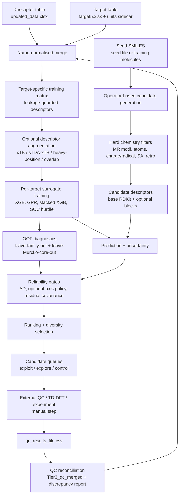
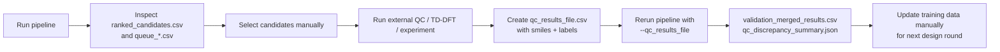

# MR-TADF Adaptive Inverse-Design Pipeline

> Publication companion pipeline for **operator-based MR-TADF candidate generation**, **target-specific surrogate modelling**, **applicability-domain-aware ranking**, and **manual external validation feedback**.


---

## Summary

This repository contains a single large command-line pipeline, `mr_tadf_bo_pipeline_v22.py`, for **multi-resonance thermally activated delayed fluorescence** candidate proposal.

The pipeline:

1. loads labelled MR-TADF molecular data,
2. trains independent surrogate models for several photophysical targets,
3. generates chemically constrained structural variants from seed molecules,
4. scores and ranks candidates under reliability and applicability-domain gates,
5. writes candidate queues for external quantum-chemical or experimental validation,
6. optionally merges user-supplied QC results from later validation rounds.

It is best understood as a **proposal and prioritisation engine**, not an automated validation framework. The script does **not** run DFT, TD-DFT, ORCA, Gaussian, or experiment internally. Optional xTB/sTDA feature blocks may run lightweight external executables for descriptors, but final validation remains outside this script.

---

## Why this repository exists

MR-TADF molecular design is difficult because the desired region of chemical space is narrow:

- small or controlled `DeltaEST`,
- acceptable singlet energy window,
- useful oscillator strength,
- favourable T2/T1 energetics,
- spin-orbit-coupling features that are often sparse, heavy-tailed, and hard to model,
- chemical plausibility and retained MR topology.

This pipeline implements a conservative inverse-design workflow around those difficulties. It combines:

- **chemistry-aware edit operators**,
- **hard filters for invalid or out-of-domain molecules**,
- **per-target surrogate models**,
- **leave-family-out and leave-Murcko-core-out diagnostics**,
- **strict applicability-domain gating**,
- **external-manual validation loop support**.

The central design choice is to avoid treating surrogate predictions as validation. Candidates are proposed for external QC or experiment; the user then feeds results back into the next run.

---

## Graphical abstract



---

## Repository scope

### Implemented in `mr_tadf_bo_pipeline_v22.py`

| Capability | Implemented? | Notes |
|---|---:|---|
| Excel descriptor/target loading | Yes | Uses `Name`-based merge after whitespace normalisation and duplicate checks. |
| Target leakage guard | Yes | Drops descriptor columns that resemble target columns before merge. |
| Independent per-target training | Yes | Rows may be missing some labels; each target uses rows with finite labels. |
| Base RDKit descriptor serving for candidates | Yes | Uses RDKit molecular descriptors plus fingerprint columns present in the training descriptor table. |
| Candidate generation | Yes | Operator-based, not deep-generative. |
| Deep generative VAE/flow/diffusion/RL | No | Removed in v18 according to the script header. Optional `torch`/`selfies` imports remain harmless. |
| xTB ground-state descriptor augmentation | Optional | Requires `xtb_descriptors.py`, an xTB executable, and verified training descriptor CSV. |
| sTDA-xTB excited-state descriptor augmentation | Optional | Requires `xtb4stda`, `stda`, and `parse_stda_xtb_important_descriptors.py` for full candidate-side computation. |
| Heavy-atom-position descriptors | Yes, default on | SMILES-only descriptors for heavy atom counts and positions. |
| Overlap / charge-transfer proxy descriptors | Optional | Requires `stda_overlap.py` and `xtb --molden`; described as screening heuristics, not rigorous population analysis. |
| Bagged XGB surrogates | Yes | Default surrogate family. |
| Gaussian-process surrogate | Optional | `--use_gpr`; mutually exclusive with stacking. |
| Stacked XGB + Ridge surrogate | Optional | `--enable_stacking`; non-SOC targets. |
| SOC hurdle model | Yes, default on | Classifier for active SOC times regressor on active subset. |
| Conformal sigma calibration | Optional | Diagnostic marginal calibration; no formal top-candidate coverage guarantee. |
| Leave-scaffold-family-out CV | Yes | Written every run in current main path. |
| Strict leave-one-Murcko-core-out CV | Yes | Written every run. |
| Candidate queues | Yes | Exploitation, exploration, control. |
| External QC reconciliation | Optional | Merges CSV by canonical SMILES. |
| Automated DFT/TD-DFT validation | No | Explicitly external/manual. |

---

## Code-to-README validation note

This README is derived from direct inspection of `mr_tadf_bo_pipeline_v22.py`.

No other `.py` files were uploaded with the repository snapshot. However, the main script references several companion modules that are required only for optional descriptor workflows:

| Referenced file | Role inferred from code | Required for baseline run? |
|---|---|---:|
| `xtb_descriptors.py` | Finds/runs xTB and produces/serves ground-state xTB descriptor blocks. | No |
| `descriptor_provenance.py` | Verifies hash-bound `.manifest.json` sidecars for training descriptor CSVs. | Only when xTB/sTDA training descriptor verification is used |
| `parse_stda_xtb_important_descriptors.py` | Parses sTDA-xTB excited-state descriptor outputs. | Only with `--use_stda_descriptors` |
| `stda_overlap.py` | Parses MOLDEN-derived frontier-overlap and charge-transfer proxy descriptors. | Only with `--use_overlap_descriptors` |
| `stda_descriptors.py` | Listed in the reproducibility source manifest; not directly imported in the inspected main path. | No direct baseline requirement inferred |

The filename contains `v22`, while several internal strings and metadata fields report `v21`. The code also contains many comments labelled `v22`. Until the maintainer harmonises version strings, this README refers to the script as the **v22 file with v21 internal metadata strings**.

---

## Suggested repository layout

```text
.
├── README.md
├── mr_tadf_bo_pipeline_v22.py
├── updated_data.xlsx
├── target5.xlsx
├── target5.xlsx.units.json
├── seeds.txt
├── qc_round1.csv
├── qc_round1.csv.units.json
├── benchmark.xlsx
├── benchmark.xlsx.units.json
├── validatedxyz/
│   ├── Molecule_A.xyz
│   └── Molecule_B.xyz
├── xtb_out/
│   ├── xtb_descriptors.csv
│   ├── xtb_descriptors.csv.manifest.json
│   └── xtb_cache_cand/
├── stda_out/
│   └── stda_cache_cand/
├── overlap_out/
│   └── overlap_cache/
├── results/
└── optional_companion_scripts/
    ├── descriptor_provenance.py
    ├── xtb_descriptors.py
    ├── parse_stda_xtb_important_descriptors.py
    ├── stda_overlap.py
    └── stda_descriptors.py
```

Only `mr_tadf_bo_pipeline_v22.py`, the descriptor table, and the target table are required for the simplest run. Unit sidecars are required by default for labelled target, QC, and benchmark files.

---

## Software environment

### Required Python libraries

The main script imports the following non-standard Python packages:

| Package | Used for |
|---|---|
| `numpy` | Numerical arrays, random sampling, linear algebra. |
| `pandas` | Excel/CSV IO, tables, output files. |
| `scipy` | Normal CDF, Spearman correlation. |
| `rdkit` | Molecule parsing, descriptors, fingerprints, scaffolds, chemistry edits. |
| `scikit-learn` | CV, scaling, imputation, metrics, GPR, nearest neighbours, Ridge meta-model. |
| `xgboost` | Default regression/classification surrogate models. |
| `matplotlib` | Parity and diagnostic plots. |
| `openpyxl` | Needed by pandas for `.xlsx` input/output reading in most environments. |

### Optional Python libraries

| Package | Status in inspected code |
|---|---|
| `torch` | Imported optionally. Deep generative models are removed, so absence should not block the current operator-only pipeline. |
| `selfies` | Imported optionally. Deep generative SELFIES use is removed with the generative stack. |

### Optional companion modules

These are not standard packages; they are repository-side `.py` files expected to sit beside the main script when the corresponding feature is enabled.

| Module | Needed when |
|---|---|
| `xtb_descriptors.py` | `--use_xtb_descriptors` or candidate geometry optimisation needs xTB discovery. |
| `descriptor_provenance.py` | Optional training descriptor CSV verification for xTB/sTDA blocks. |
| `parse_stda_xtb_important_descriptors.py` | `--use_stda_descriptors`. |
| `stda_overlap.py` | `--use_overlap_descriptors`. |

### Optional external executables

| Executable | Used by |
|---|---|
| `xtb` | xTB descriptors, candidate GFN2-xTB geometry optimisation, overlap descriptors via MOLDEN. |
| `xtb4stda` | sTDA-xTB workflow. |
| `stda` | sTDA excited-state descriptor workflow. |

### Example conda environment

```bash
conda create -n mr-tadf python=3.10 -c conda-forge \
  rdkit numpy pandas scipy scikit-learn xgboost matplotlib openpyxl

conda activate mr-tadf
```

Optional:

```bash
pip install torch selfies
```

`torch` and `selfies` are not required for the current operator-only pipeline, but the script tolerates their presence.

---

## Input data contract

### Descriptor table: `--data`

Default:

```text
updated_data.xlsx
```

The script reads the descriptor workbook with pandas and then renames:

- first column → `Name`,
- second column → `SMILES`.

All other columns are treated as descriptor columns after target-leakage filtering.

The descriptor table should therefore be shaped like:

| Name | SMILES | descriptor_1 | descriptor_2 | ... |
|---|---|---:|---:|---:|
| Molecule_A | `...` | ... | ... | ... |
| Molecule_B | `...` | ... | ... | ... |

### Target table: `--target`

Default:

```text
target5.xlsx
```

The script renames the first column to `Name` and expects any of the following target columns:

| Target column | Meaning in pipeline | Unit role |
|---|---|---|
| `DeltaEST` | Singlet-triplet energy gap target | energy |
| `T2-T1` | Triplet-triplet gap target | energy |
| `T1-S1(SOC)` | T1/S1 spin-orbit coupling target | SOC |
| `T2-S1(SOC)` | T2/S1 spin-orbit coupling target | SOC |
| `Oscillator Strengths` | Oscillator strength target | dimensionless |
| `Singlets` | Singlet energy target | energy |

Rows are retained if at least one target is present. Each target model trains on its own finite-label subset.

### Unit sidecar requirement

By default, labelled target, QC, and benchmark files require a hash-bound sidecar:

```text
target5.xlsx.units.json
```

Example for `--energy_units eV --soc_units cm-1`:

```json
{
  "schema": "mr_tadf_external_units_v1",
  "data_file": {
    "sha256": "<sha256-of-target5.xlsx>"
  },
  "columns": {
    "DeltaEST": "eV",
    "T2-T1": "eV",
    "Singlets": "eV",
    "T1-S1(SOC)": "cm-1",
    "T2-S1(SOC)": "cm-1",
    "Oscillator Strengths": "dimensionless"
  }
}
```

A missing sidecar can be bypassed only with:

```bash
--allow_missing_unit_contract
```

A present but stale or contradictory sidecar always aborts.

---

## Quick start

### Minimal operator-only run

```bash
python mr_tadf_bo_pipeline_v22.py \
  --data updated_data.xlsx \
  --target target5.xlsx \
  --output results/basic
```

For legacy data without unit sidecars:

```bash
python mr_tadf_bo_pipeline_v22.py \
  --data updated_data.xlsx \
  --target target5.xlsx \
  --output results/basic_legacy \
  --allow_missing_unit_contract
```

### Run with a separate seed list

```bash
python mr_tadf_bo_pipeline_v22.py \
  --data updated_data.xlsx \
  --target target5.xlsx \
  --seed_file seeds.txt \
  --n_candidates 10000 \
  --output results/seeded
```

A `.txt` seed file should contain one SMILES per line. An `.xlsx` seed file is also accepted; the script reads the second column when present, otherwise the first.

### More publication-oriented run

```bash
python mr_tadf_bo_pipeline_v22.py \
  --data updated_data.xlsx \
  --target target5.xlsx \
  --seed_file seeds.txt \
  --n_candidates 10000 \
  --objective adaptive \
  --calibrate_sigma \
  --scaffold_conformal \
  --enable_residual_cov \
  --validation_history_file validation_history.json \
  --output results/adaptive_round1
```

### Run with xTB and sTDA descriptor augmentation

```bash
python mr_tadf_bo_pipeline_v22.py \
  --data updated_data.xlsx \
  --target target5.xlsx \
  --seed_file seeds.txt \
  --use_xtb_descriptors \
  --xtb_descriptors_file xtb_out/xtb_descriptors.csv \
  --xtb_bin /path/to/xtb \
  --use_stda_descriptors \
  --stda_descriptors_file stda_xtb_important_descriptors.csv \
  --xtb4stda_bin /path/to/xtb4stda \
  --stda_bin /path/to/stda \
  --n_candidates 1000 \
  --output results/with_multifidelity_descriptors
```

This mode is slower because candidate-side descriptors may be computed on the fly and cached.

### Merge external QC results

```bash
python mr_tadf_bo_pipeline_v22.py \
  --data updated_data.xlsx \
  --target target5.xlsx \
  --seed_file seeds.txt \
  --qc_results_file qc_round1.csv \
  --validation_history_file validation_history.json \
  --output results/round1_qc_merged
```

The QC CSV must contain a `smiles` column plus any target columns to merge.

---

## Full command-line interface

### Core IO and execution options

| Option | Default | Description |
|---|---:|---|
| `--data` | `updated_data.xlsx` | Descriptor workbook. First column becomes `Name`; second becomes `SMILES`. |
| `--target` | `target5.xlsx` | Label workbook merged by `Name`. |
| `--seed_file` | `None` | Optional seed SMILES file, `.txt` or `.xlsx`. If omitted, training SMILES are used as seeds. |
| `--benchmark_file` | `None` | Optional external benchmark SMILES file or labelled benchmark workbook. |
| `--n_candidates` | `10000` | Requested number of generated candidates. |
| `--n_workers` | `0` | Number of multiprocessing workers. `0` auto-selects CPU count with an upper cap. |
| `--attempts_per_worker` | `500000` | Maximum edit attempts per worker. |
| `--n_ensemble` | `20` | Bag size for deployed XGB-style ensembles. |
| `--output` | `results` | Output directory. |
| `--max_train_threads` | `0` | Training thread cap. `0` becomes unrestricted/`None`. |

### Generation and chemical-space options

| Option | Default | Description |
|---|---:|---|
| `--exploratory` | `False` | Enables exploratory atom substitutions and exploratory allowed atoms. |
| `--min_core_sim_parent` | `0.70` | Minimum parent-core similarity threshold. |
| `--min_core_sim_train` | `0.60` | Minimum training-core similarity threshold. |
| `--max_whole_sim_train` | `0.95` | Maximum whole-molecule similarity to training molecules. |
| `--min_heavy_atoms` | `12` | Minimum heavy atoms for hard-filter acceptance. |
| `--max_heavy_atoms` | `100` | Maximum heavy atoms for hard-filter acceptance. |
| `--enable_bulky` | `False` | Enables bulky substituent operator sites such as `tBu`. |
| `--enable_diaza` | `False` | Enables paired diaza substitution. |
| `--enable_annulation` | `False` | Activates the plain benzannulation operator. |
| `--novelty_mode` | `balanced` | One of `conservative`, `balanced`, `exploratory`; changes similarity/trust thresholds. |

`--novelty_mode conservative` internally tightens parent-core similarity and permits higher whole-molecule similarity to training chemistry. `--novelty_mode exploratory` lowers parent-core similarity and whole-training similarity thresholds to push farther from known compounds.

### Ranking and objective options

| Option | Default | Description |
|---|---:|---|
| `--objective` | `adaptive` | One of `adaptive`, `dEST`, `TADF_FoM`, `dEST_fOSC`. |
| `--singlet_min_eV` | `2.0` | Lower singlet-energy window edge under adaptive objective. |
| `--singlet_max_eV` | `3.5` | Upper singlet-energy window edge under adaptive objective. |
| `--adaptive_min_ad` | `0.25` | Minimum AD score before optional adaptive axes may influence ranking. |
| `--adaptive_min_core_train` | `2` | Minimum exact-Murcko-core training rows before optional axes may be used. |
| `--adaptive_min_axis_oof_r2` | `0.0` | Minimum strict-core OOF R² for optional axis activation. |
| `--adaptive_max_core_mae_factor` | `1.5` | Local core MAE limit as a multiple of pooled strict-core OOF MAE. |
| `--adaptive_min_core_eval` | `2` | Minimum rows in held-out exact-core fold for local reliability evidence. |
| `--adaptive_joint_mc_samples` | `4096` | Monte Carlo samples for correlated adaptive joint feasibility when residual covariance is enabled. |
| `--T2_T1_CONSTRAINT` | `0.40` | Upper T2-T1 feasibility threshold in eV. |
| `--fosc_min` | `0.01` | Minimum oscillator-strength threshold. |
| `--soc1_min` | `0.01` | Minimum T1-S1 SOC gate threshold in cm⁻¹. |
| `--soc2_min` | `0.05` | Minimum T2-S1 SOC gate threshold in cm⁻¹. |
| `--gap_max_eV` | `0.5` | Maximum feasible `DeltaEST` for non-inverted TADF regime. |
| `--allow_inverted_singlet` | `False` | Opt into inverted-singlet heuristic ranking. |

Objective interpretation:

| Objective | Ranking intent | SOC role |
|---|---|---|
| `adaptive` | Minimise `DeltaEST`, enforce singlet window, enable fOSC/T2-T1 only when reliability evidence supports them. | Deferred; predictions and screening scores are reported but not optimised/gated. |
| `dEST` | Legacy single-target `DeltaEST` minimisation EI. | Not central. |
| `dEST_fOSC` | Legacy predictable-axis score, roughly `log10(fOSC) - 2 log10(DeltaEST)`. | Deferred. |
| `TADF_FoM` | Legacy full figure of merit including SOC². | Optimised/gated; should be used only where SOC modelling is trusted. |

### Units

| Option | Default | Description |
|---|---:|---|
| `--energy_units` | `eV` | Units for `DeltaEST`, `T2-T1`, and `Singlets`. Allowed: `eV`, `meV`, `cm-1`, `kcal/mol`, `kJ/mol`, `hartree`. |
| `--soc_units` | `cm-1` | Units for SOC targets. Allowed: `cm-1`, `meV`, `eV`, `hartree`. |

### Surrogate model options

| Option | Default | Description |
|---|---:|---|
| `--use_gpr` | `False` | Use Gaussian-process surrogate for non-SOC targets. Mutually exclusive with stacking. |
| `--gp_alpha` | `0.1` | Tikhonov ridge/noise floor for GPR. |
| `--enable_stacking` | `False` | Use XGB bag → Ridge stacked ensemble for non-SOC targets. |
| `--stacking_alpha` | `1.0` | Ridge alpha for stacking meta-model. |
| `--n_ensemble` | `20` | Deployed bag size. |
| `--cv_n_ensemble` | `8` | Ensemble size used inside CV and y-scramble baselines. |
| `--select_features_targets` | `DeltaEST,T2-T1,OscStr,T1-S1(SOC),T2-S1(SOC)` | Comma-separated target list for per-target top-k feature selection. |
| `--select_top_k` | `DeltaEST:40,T2-T1:40,OscStr:40,T1-S1(SOC):20,T2-S1(SOC):20` | Per-target or fallback feature-count specification. |

### SOC modelling options

| Option | Default | Description |
|---|---:|---|
| `--soc_hurdle` | `True` | Use two-stage SOC model: active classifier × active-subset regressor. |
| `--no_soc_hurdle` | — | Disable hurdle and fall back to single-regressor SOC path. |
| `--soc_active_threshold` | `0.5` | SOC threshold in cm⁻¹ for active/large SOC classification. |
| `--asinh_soc` | `True` | Train SOC targets in asinh-transformed space and inverse-transform predictions. |
| `--no_asinh_soc` | — | Disable SOC asinh transform. |
| `--soc_xgb` | `True` | Force SOC targets to bagged XGB even when non-SOC targets use GPR/stacking. |
| `--no_soc_xgb` | — | Let SOC use the same surrogate family as other targets when hurdle is off. |
| `--use_heavy_pos` | `True` | Add heavy-atom-position descriptors. |
| `--no_heavy_pos` | — | Disable heavy-atom-position descriptor block. |

### Optional descriptor augmentation

| Option | Default | Description |
|---|---:|---|
| `--use_xtb_descriptors` | `False` | Add GFN2-xTB ground-state descriptor block. |
| `--xtb_descriptors_file` | `xtb_out/xtb_descriptors.csv` | Training-set xTB descriptor CSV. |
| `--xtb_bin` | `None` | Path to xTB executable; auto-detected if omitted. |
| `--xtb_cache` | `xtb_out/xtb_cache_cand` | Candidate xTB descriptor cache directory. |
| `--use_stda_descriptors` | `False` | Add sTDA-xTB excited-state descriptor block. |
| `--stda_descriptors_file` | `stda_xtb_important_descriptors.csv` | Training-set sTDA descriptor CSV. |
| `--stda_cache` | `stda_out/stda_cache_cand` | Candidate sTDA descriptor cache directory. |
| `--xtb4stda_bin` | `None` | Path to `xtb4stda`; auto-detected if omitted. |
| `--stda_bin` | `None` | Path to `stda`; auto-detected if omitted. |
| `--stda_ewin` | `10.0` | sTDA energy window in eV. |
| `--stda_timeout` | `600` | Per-molecule timeout in seconds for sTDA/geometry descriptor workflows. |
| `--use_overlap_descriptors` | `False` | Add MOLDEN-derived frontier-overlap and charge-transfer proxy descriptors. |
| `--no_overlap_descriptors` | — | Disable overlap descriptors. |
| `--overlap_xyz_dir` | `validatedxyz` | Training geometry directory for overlap descriptors. |
| `--overlap_cache` | `overlap_out/overlap_cache` | Manifest-keyed overlap descriptor cache. |
| `--opt_candidate_geom` | `None` | Force candidate GFN2-xTB optimisation before geometry-dependent descriptor computation. |
| `--no_opt_candidate_geom` | — | Force candidate geometries to remain RDKit/MMFF. |
| `--min_descriptor_success` | `0.5` | Minimum real-value fraction for enabled descriptor blocks. |
| `--strict_descriptors` | `False` | Abort if any enabled descriptor block falls below `--min_descriptor_success`. |
| `--allow_unverified_descriptor_csv` | `False` | Legacy opt-out for descriptor CSVs without verified `.manifest.json` sidecars. |

Candidate geometry optimisation is tri-state:

| User setting | Behaviour |
|---|---|
| omitted | Auto-enable when geometry-dependent descriptors are active and xTB is available. |
| `--opt_candidate_geom` | Force GFN2-xTB optimisation if possible. |
| `--no_opt_candidate_geom` | Force RDKit/MMFF candidate geometries. |

### Validation, calibration, and diagnostics

| Option | Default | Description |
|---|---:|---|
| `--calibrate_sigma` | `False` | Hold out scaffold-stratified calibration split for conformal sigma scaling. |
| `--scaffold_conformal` | `False` | Add per-scaffold conformal kappa when calibration is enabled. |
| `--scaffold_cv` | `False` | CLI flag remains, but current main path writes scaffold-stratified CV reports every run. |
| `--core_split_cv_min_test` | `1` | Minimum held-out Murcko-core fold size. |
| `--y_scramble_n` | `1` | Number of y-scramble baselines in leave-family-out CV. |
| `--enable_residual_cov` | `False` | Compute out-of-fold residual covariance for correlated feasibility/FoM sampling. |
| `--benchmark_file` | `None` | Optional benchmark prediction/evaluation file. |
| `--qc_results_file` | `None` | Optional CSV with `smiles` and target columns for QC reconciliation. |
| `--validation_history_file` | `<output>/validation_history.json` | Persistent cross-run validation-history JSON. |

### Label weighting and data-integrity options

| Option | Default | Description |
|---|---:|---|
| `--label_source_col` | `None` | Target-file column identifying label source, such as experiment vs DFT. |
| `--label_source_weights` | `None` | JSON mapping from source value to sample weight. |
| `--duplicate_conflict_policy` | `error` | One of `error`, `first`. Default aborts on conflicting duplicate `Name` keys. |
| `--allow_missing_unit_contract` | `False` | Legacy opt-out for missing labelled-file unit sidecars. |

### Applicability-domain, diversity, and queue options

| Option | Default | Description |
|---|---:|---|
| `--ad_hard_threshold` | `0.15` | Candidates below this AD score are hard rejected before ranking. |
| `--ad_soft_threshold` | `0.40` | Candidates in the soft band receive trust penalty. |
| `--diversity_lambda` | `0.3` | Diversity-selection weighting. |
| `--top_diverse_n` | `50` | Number of diverse candidates selected. |
| `--max_per_parent` | `10` | Maximum diverse shortlist entries per parent. |
| `--max_per_scaffold_family` | `30` | Maximum diverse shortlist entries per scaffold family. |
| `--n_exploit` | `30` | Exploitation queue size. |
| `--n_explore` | `30` | Exploration queue size. |
| `--n_control` | `20` | Control queue size. |

### Chemistry-filter override options

These are primarily for testing and ablation. They weaken default safeguards.

| Option | Default | Description |
|---|---:|---|
| `--sascore_max` | `6.0` | Maximum corpus-relative synthetic-accessibility heuristic score. |
| `--disable_sa_filter` | `False` | Disable accessibility-heuristic gate. |
| `--disable_retro_filter` | `False` | Disable retrosynthesis-feasibility heuristic gate. |
| `--disable_charge_radical_filter` | `False` | Disable neutral closed-shell charge/radical gate. |

---

## Candidate generation details

The generator is **operator-based**. It mutates seed molecules using chemically constrained edit operations and then applies sanitisation, MR-motif checks, topology checks, atom filters, and trust filters.

### Supported scaffold families

The classifier supports the following MR-TADF scaffold family labels:

| Label | Meaning |
|---|---|
| `BN-MR` | Boron-nitrogen MR family. |
| `BO-MR` | Boron-oxygen MR family. |
| `CARBONYL-MR` | Carbonyl-containing MR family. |
| `SE-MR` | Selenium-containing MR family. |
| `TE-MR` | Tellurium-containing MR family. |
| `PO-MR` | Phosphine oxide MR family. |
| `PS-MR` | Phosphine sulfide MR family. |
| `PSE-MR` | Phosphine selenide MR family. |
| `NO-MR` | Nitrogen-oxygen MR family. |
| `OTHER` | Fallback family. |

### Atom-site roles

The script labels atoms by role before deciding whether an edit is permitted:

| Role | Interpretation |
|---|---|
| `FROZEN` | Do not edit; atom is central to MR motif/topology. |
| `NODE_SAFE` | Safer edit site, often non-frontier carbon. |
| `HOMO` | Near donor/HOMO region. |
| `LUMO` | Near acceptor/LUMO region. |
| `OVERLAP` | Near donor and acceptor regions; generally protected. |
| `STERIC` | Peripheral site where steric edit may be permitted. |
| `PERIM` | Perimeter expansion site. |
| `MODERATE` | Intermediate-risk site. |
| `FORBIDDEN` | Out-of-scope site. |

### Edit operators

The generator includes the following mutation families:

| Operator family | Description |
|---|---|
| `F` | Single aromatic fluorination. |
| `paired_F` | Symmetry-paired fluorination. |
| `CH3` | Single methyl substitution. |
| `paired_CH3` | Symmetry-paired methyl substitution. |
| `aza` | Aromatic atom substitution, including C↔N and selected chalcogen swaps. |
| `F+aza` | Combined fluorination and aza/chalcogen substitution. |
| `diaza` | Paired diaza substitution when enabled. |
| `tBu` | Bulky tert-butyl substitution when enabled. |
| `annul` | Plain benzannulation when `--enable_annulation` is enabled. |
| `graft_D` | Donor grafting at permitted perimeter/node-safe sites. |
| `CN` | Cyano substitution at permitted sites. |
| `SO2` | Sulfone oxidation of aromatic sulfur sites. |
| `q4_bridge` | sp³ quaternary bridge insertion at suitable biaryl single bonds. |
| `rim_BN` | ν-DABNA-style B/N rim extension on B-containing cores. |
| `P_insert[P=O/P=S/P=Se]` | P-chalcogenide insertion at suitable biaryl bonds. |
| `carbonyl_MR_annulation` | v22 carbonyl-MR annulation topology builder. |
| `QAO_DiKTa_extension` | v22 QAO/DiKTa-like extension. |
| `BON_fused_extension` | v22 B/O/N fused extension on existing boron cores. |
| `rim_BON` | B/O analogue of rim-BN extension. |
| `multi_boron_fusion` | v22 multi-boron fusion on existing boron MR frameworks. |
| `direct_double_borylation` | v22 paired/disjoint borylation-style extension. |
| `spirofluorene_fusion` | v22 spirofluorene fusion or de-novo precursor-and-lock variant. |
| `spiro_lock` | v22 spiro lock operation. |
| `sulfur_lock` | v22 dibenzothiophene-style lock. |
| `chalcogen_lock` | v22 S/Se/Te chalcogen lock; Te only in exploratory mode. |
| `site_specific_chalcogen_scan` | Symmetry-distinct chalcogen scan. |
| `O_to_S_position_scan` | Ring oxygen to sulfur position scan. |
| `O_to_Se_position_scan` | Ring oxygen to selenium position scan. |

### Hard-filter defaults

| Filter | Default |
|---|---|
| Allowed atoms | B, C, N, O, F, P, S, Se, Te |
| Exploratory-only additions | Si, Ge |
| Heavy atom range | 12–100 |
| Minimum aromatic rings | 3 |
| Maximum rotatable bonds | 3 |
| Synthetic-accessibility heuristic cap | 6.0 |
| Charge/radical gate | Rejects non-neutral, charged, or radical/open-shell molecules |
| Retrosynthesis heuristic | Rejects selected cumulenes, polyynes, charged motifs, exotic Se/Te motifs, macrocycles, etc. |
| MR motif requirement | Candidate must retain an MR-relevant motif/core classification. |

The synthetic-accessibility score is explicitly **corpus-relative** and **not the canonical Ertl-Schuffenhauer SAscore**.

---

## Surrogate modelling details

### Targets

The script trains independent models for:

| Internal label | Source column |
|---|---|
| `DeltaEST` | `DeltaEST` |
| `T2-T1` | `T2-T1` |
| `T1-S1(SOC)` | `T1-S1(SOC)` |
| `T2-S1(SOC)` | `T2-S1(SOC)` |
| `OscStr` | `Oscillator Strengths` |
| `Singlets` | `Singlets` |

### Default modelling policy

| Target type | Default model |
|---|---|
| Non-SOC targets | Bagged XGBoost regressor |
| SOC targets | Two-stage hurdle model with XGBoost classifier and XGBoost regressor |
| SOC transform | asinh transform on SOC values, inverse-transformed for output |
| Candidate prediction units | User-declared units from `--energy_units` and `--soc_units` |

### SOC hurdle logic

For each SOC target, the default model estimates:

```text
E[SOC | x] ≈ P(SOC > threshold | x) × E[SOC | active, x]
```

where:

- the active threshold is controlled by `--soc_active_threshold`,
- the default threshold is `0.5 cm-1`,
- predictions are returned in linear SOC units,
- `score_large_T1S1_SOC` and `score_large_T2S1_SOC` are screening estimates, not proof of calibrated SOC probability.

### Feature selection

By default, top-k feature selection is applied to:

```text
DeltaEST,T2-T1,OscStr,T1-S1(SOC),T2-S1(SOC)
```

Default top-k values:

```text
DeltaEST:40
T2-T1:40
OscStr:40
T1-S1(SOC):20
T2-S1(SOC):20
```

`Singlets` is deliberately excluded from default selection in the code comments because its signal is described as distributed across features.

---

## Applicability domain and decision logic

### Applicability-domain score

The pipeline computes an AD score from descriptor-space and fingerprint-space support. It then applies:

| Gate | Default | Effect |
|---|---:|---|
| Hard AD threshold | `0.15` | Candidate is rejected before ranking. |
| Soft AD threshold | `0.40` | Candidate receives a trust penalty. |

### Adaptive objective

Under `--objective adaptive`, the script always uses:

- `DeltaEST`,
- singlet energy window.

It enables optional axes only when evidence supports them:

- fOSC axis,
- T2-T1 axis.

The optional-axis decision requires local support from:

1. exact Murcko-core training count,
2. target-specific AD,
3. strict leave-one-Murcko-core-out reliability,
4. held-out exact-core MAE evidence.

SOC is deferred under adaptive mode. SOC predictions and large-SOC screening scores are reported, but they are not used as hard optimisation axes in the adaptive objective.

### Feasibility probabilities

The output schema may include:

| Column | Meaning |
|---|---|
| `p_T2T1` | Probability-like feasibility factor for T2-T1. |
| `p_fOSC` | Probability-like feasibility factor for oscillator strength. |
| `p_Singlet_window` | Probability of singlet energy lying in requested window. |
| `p_T2T1_applied` | Adaptive T2-T1 factor actually applied. |
| `p_fOSC_applied` | Adaptive fOSC factor actually applied. |
| `p_dEST_feas` | Probability of `DeltaEST` being in feasible regime. |
| `p_adaptive_joint` | Correlated joint feasibility estimate when residual covariance is enabled. |
| `p_SOC1` | SOC1 feasibility factor, mainly for legacy full FoM objective. |
| `p_SOC2` | SOC2 feasibility factor, mainly for legacy full FoM objective. |
| `cei` | Constraint-weighted acquisition value. |

If every candidate has zero acquisition or zero final score, the script writes `infeasible_candidates.csv` and skips misleading ranked/queue outputs.

---

## Validation workflow

The validation workflow is explicitly external and manual.



Validation tiers:

| Tier | Meaning |
|---|---|
| `Tier1_surrogate` | Candidate has surrogate predictions only. |
| `Tier2_qc_requested` | QC file was supplied, but this shortlisted candidate was not matched. |
| `Tier3_qc_merged` | Candidate matched external QC results and QC columns were merged. |

---

## Outputs

### Main candidate tables

| File | Description |
|---|---|
| `all_scored.csv` | Full scored candidate audit table. Written even when ranking aborts due to all-infeasible candidates. |
| `ranked_candidates.csv` | Ranked candidates after feasibility, trust, AD, and property filters. |
| `top50_candidates.csv` | Top 50 ranked candidates. |
| `top_diverse_candidates.csv` | Diversity-selected shortlist. |
| `queue_exploit.csv` | Exploitation queue, sorted primarily by final score. |
| `queue_explore.csv` | Exploration queue, sorted primarily by novelty. |
| `queue_control.csv` | Control queue, selected near seed/parent chemistry. |
| `export_validation_queue.csv` | Compact validation queue for external QC/experiment. |
| `topology_summary.csv` | Topology and novelty descriptors for the diverse shortlist. |
| `infeasible_candidates.csv` | Written when every candidate fails feasibility/ranking gates. |

### Diagnostics and metadata

| File | Description |
|---|---|
| `metadata.json` | Full run summary, arguments, model configuration, validation mode, descriptor health, CV summaries, queue counts, AD statistics. |
| `publication_diagnostics.json` | Publication-oriented summary of candidate counts, novelty, AD, shortlist topology, objective, and uncertainty-error correlations. |
| `reproducibility_manifest.json` | Runtime, source-file hashes, input-file hashes, executable manifests, package versions, unit contracts. |
| `scaffold_stratified_cv.json` | Leave-scaffold-family-out out-of-fold CV report. |
| `core_split_cv.json` | Strict leave-one-Murcko-core-out CV report. |
| `uncertainty_error_correlation.json` | Spearman correlation between OOF uncertainty estimates and absolute errors. |
| `residual_covariance.json` | Optional out-of-fold residual covariance when `--enable_residual_cov` is enabled. |
| `conformal_kappa.json` | Optional global conformal sigma scaling factors. |
| `conformal_kappa_by_scaffold.json` | Optional scaffold-aware conformal factors. |
| `conformal_support.json` | Scope/support report for conformal intervals. |
| `adaptive_axis_training_only_core_cv.json` | Optional adaptive-axis reliability report when conformal split is used. |
| `validation_history.json` | Cross-run active-learning validation history. |
| `qc_discrepancy_summary.json` | QC-vs-surrogate discrepancy summary when QC results are merged. |
| `benchmark_predictions.csv` | Benchmark predictions when `--benchmark_file` is supplied. |
| `benchmark_metrics.json` | Benchmark metrics when benchmark labels are available. |

### Plots

| File pattern | Description |
|---|---|
| `regression_<target>.png` | Leave-scaffold-family-out out-of-fold parity plot. This is the headline diagnostic plot family. |
| `regression_insample_<target>.png` | In-sample/resubstitution parity plot. Not a generalisation estimate. |
| `novelty_vs_AD.png` | Novelty vs applicability-domain diagnostic. |
| `parent_core_vs_score.png` | Parent-core similarity vs final score. |
| `scaffold_family_barplot.png` | Scaffold-family distribution in diverse shortlist. |
| `interpretability/feature_importance_summary.json` | Feature-importance summary when available. |

---

## Stable scored CSV schema

The script routes scored outputs through a deterministic schema helper so downstream analysis sees stable columns. Important column groups include:

### Prediction columns

```text
pred_DeltaEST
unc_DeltaEST
pred_T2_T1
unc_T2_T1
pred_T1S1_SOC
unc_T1S1_SOC
pred_T2S1_SOC
unc_T2S1_SOC
score_large_T1S1_SOC
score_large_T2S1_SOC
pred_OscStr
unc_OscStr
pred_Singlets
unc_Singlets
```

### Novelty, AD, and trust columns

```text
MR_quality
novelty_score
subst_topo_novelty
core_topo_novelty
sym_pattern_novelty
AD_score
trust_parent
trust_train
nearest_train_tanimoto_whole
nearest_train_tanimoto_core
nearest_seed_tanimoto_whole
nearest_seed_tanimoto_core
parent_tanimoto_whole
parent_tanimoto_core
core_fp_valid
core_invalid_risk
```

### Core/topology columns

```text
core_n_donor
core_n_acceptor
core_sym_index
core_size
core_n_perim_expand
core_n_overlap
core_n_boron
core_is_rim_extended
n_Cz_pendants
n_DBhet_pendants
heavy_atom_z4sum
core_topology_distance_to_parent
core_topology_distance_to_seed_family
subst_topo_dist_parent
subst_topo_dist_seed_family
subst_topo_dist_shortlist
parent_seed_smiles
parent_scaffold_type
candidate_scaffold_type
murcko_core_key
murcko_core_train_count
known_core
high_AD
optional_axes_enabled
adaptive_objective_mode
T2T1_axis_AD
fOSC_axis_AD
T2T1_core_train_count
fOSC_core_train_count
T2T1_core_reliable
fOSC_core_reliable
T2T1_axis_enabled
fOSC_axis_enabled
subst_topo_sig
sym_pattern_sig
```

### Edit provenance columns

```text
edit_depth
mutation_family
new_edit_family
mr_topology_operator
annulation_edge
n_B_after
n_O_after
n_carbonyl_after
n_S_after
n_Se_after
has_spiro_lock
has_chalcogen_lock
chalcogen_lock_element
heavy_atom_core_distance
heavy_atom_acceptor_distance
```

### Scoring and feasibility columns

```text
log_TADF_FoM
log_FoM_predictable
EI_acquisition
p_T2T1
p_fOSC
p_Singlet_window
p_T2T1_applied
p_fOSC_applied
p_dEST_feas
p_adaptive_joint
adaptive_feasibility_method
p_SOC1
p_SOC2
cei
final_score
score_no_novelty
score_no_trust
validation_priority_score
```

### Gate and shortlist columns

```text
AD_hard_rejected
descriptor_blocks_ok
descriptor_integrity_rejected
descriptor_failure_count
descriptor_failed_blocks
descriptor_min_real_fraction
conformal_family_supported
conformal_required_targets
conformal_interval_scope
queue
ranking_filter_level
diversity_selected
validation_tier
```

---

## How to use the workflows together

### Round 1: propose candidates

```bash
python mr_tadf_bo_pipeline_v22.py \
  --data updated_data.xlsx \
  --target target5.xlsx \
  --seed_file seeds.txt \
  --objective adaptive \
  --n_candidates 10000 \
  --output results/round1
```

Inspect:

```text
results/round1/ranked_candidates.csv
results/round1/top_diverse_candidates.csv
results/round1/queue_exploit.csv
results/round1/queue_explore.csv
results/round1/queue_control.csv
results/round1/export_validation_queue.csv
```

### Round 2: externally validate

Run QC, TD-DFT, or experiment outside this script. Prepare a CSV:

```csv
smiles,DeltaEST,T2-T1,Oscillator Strengths,Singlets,T1-S1(SOC),T2-S1(SOC)
...
```

Also prepare the corresponding `.units.json` sidecar unless using the legacy unit-contract opt-out.

### Round 3: reconcile QC

```bash
python mr_tadf_bo_pipeline_v22.py \
  --data updated_data.xlsx \
  --target target5.xlsx \
  --seed_file seeds.txt \
  --qc_results_file qc_round1.csv \
  --validation_history_file validation_history.json \
  --output results/round1_reconciled
```

Inspect:

```text
results/round1_reconciled/validation_merged_results.csv
results/round1_reconciled/qc_discrepancy_summary.json
validation_history.json
```

### Round 4: update training data manually

The script does not automatically append QC labels into the training workbook. The user should curate validated labels into the training/target files before the next design iteration.

---

## Reproducibility notes

The script improves auditability through:

- deterministic global seed `SEED = 42`,
- hash-bound unit sidecars for labelled files,
- hash-verified descriptor CSV manifests for optional xTB/sTDA training blocks,
- runtime package version capture,
- source-file SHA256 capture,
- executable path/SHA256 capture,
- argument capture in `reproducibility_manifest.json`.

However, exact bitwise reproducibility is not guaranteed because:

- multiprocessing candidate generation may depend on worker scheduling,
- external executable versions and numerical libraries can change results,
- xTB/sTDA candidate descriptor generation depends on external tools and geometry generation,
- no pinned `environment.yml` or `requirements.txt` was provided with the uploaded file.

For publication release, add a locked environment file and archive the exact input data, descriptor manifests, and external executable versions.

---

## Methodological contribution

The script contributes a **reliability-gated inverse-design workflow** for MR-TADF candidate proposal. Its notable implementation ideas are:

1. **Target-specific finite-label training** rather than complete-case-only fitting.
2. **Descriptor leakage guard** before descriptor-target merge.
3. **SOC-specific modelling policy** using asinh transforms and a hurdle model for sparse/heavy-tailed SOC labels.
4. **Adaptive objective** that avoids using optional axes unless local support and held-out-core evidence justify them.
5. **Strict leave-scaffold-family-out and leave-Murcko-core-out diagnostics** for generalisation reporting.
6. **Applicability-domain hard and soft gates** before ranking.
7. **External-manual validation loop** with QC reconciliation and persistent validation history.
8. **Stable output schema** for downstream post-processing.

These are workflow and software-engineering contributions. They do not by themselves establish that any proposed molecule is experimentally viable or that surrogate predictions are quantitatively accurate outside the supported domain.

---

## Interpretation guide

### Trust more

- Out-of-fold metrics in `scaffold_stratified_cv.json`.
- Strict Murcko-core CV metrics in `core_split_cv.json`.
- Candidates with high `AD_score`.
- Candidates with `known_core = True` and sufficient `murcko_core_train_count`.
- Candidates not rejected by descriptor integrity gates.
- Candidates passing strict ranking filters.
- QC-merged rows marked `Tier3_qc_merged`.

### Treat cautiously

- `regression_insample_*.png`; these are resubstitution plots.
- SOC magnitudes in low-support regions.
- `score_large_*_SOC`; these are screening estimates, not validated calibrated probabilities.
- Candidates created by topology-changing operators far from training cores.
- Runs using `--allow_missing_unit_contract`.
- Runs using `--allow_unverified_descriptor_csv`.
- Runs where descriptor-health metadata reports mostly imputed optional descriptor blocks.
- Inverted-singlet mode; the code treats it as a heuristic design regime.

---

## Recommended additions for publication readiness

Before public release with a manuscript, consider adding:

1. `LICENSE`.
2. `environment.yml` or `requirements.txt` with tested versions.
3. Small toy input dataset that can run in minutes.
4. Example `target5.xlsx.units.json`.
5. Example seed file.
6. Example QC feedback CSV.
7. Example output bundle from a smoke run.
8. Companion scripts referenced by optional workflows:
   - `descriptor_provenance.py`,
   - `xtb_descriptors.py`,
   - `parse_stda_xtb_important_descriptors.py`,
   - `stda_overlap.py`.
9. A short `docs/` page explaining target units and sidecar generation.
10. CI smoke test that runs a tiny candidate generation job.
11. Explicit citation metadata in `CITATION.cff`.
12. A manuscript-linked archive with frozen data and output hashes.

---

## Limitations

- The pipeline does **not** run final DFT, TD-DFT, or experiment.
- Candidate validation is external and manual.
- The SA score is a local corpus-relative heuristic, not canonical SAscore.
- Retrosynthesis filtering is heuristic.
- SOC prediction remains difficult; the hurdle model and heavy-position descriptors are screening tools, not definitive validation.
- Conformal intervals are diagnostic for exchangeable future points and do not guarantee coverage after adaptive generation and top-candidate selection.
- Optional descriptor blocks require external tools and companion scripts not included in the uploaded snapshot.
- The internal metadata string reports `v21` even though the uploaded filename and many comments refer to `v22`.
- The script is a large monolithic CLI file; modularisation would improve maintainability.
- No pinned software environment was provided.
- No license was provided in the uploaded material.

---

## Example citation block

Until a manuscript DOI is available, cite the repository as software:

```bibtex
@software{mr_tadf_pipeline,
  title        = {MR-TADF Adaptive Reliability-Gated Inverse-Design Pipeline},
  author       = {Your Name and Contributors},
  year         = {2026},
  url          = {https://github.com/your-org/your-repo},
  note         = {Operator-based candidate proposal pipeline with surrogate ranking and external-manual validation feedback}
}
```

For a manuscript companion release, replace `url` and metadata with the archived repository DOI.

---

## Acknowledgments

This code uses open-source scientific Python and cheminformatics tools, including RDKit, NumPy, pandas, SciPy, scikit-learn, XGBoost, and Matplotlib. Optional descriptor workflows may rely on xTB, xtb4stda, and sTDA executables.

---

## Maintainer note

This README intentionally distinguishes between:

- implemented automated functionality,
- optional descriptor workflows requiring additional scripts/executables,
- diagnostic model-validation reports,
- external manual QC/experimental validation.

For publication, avoid describing the ranked candidates as validated molecules. They are **surrogate-prioritised proposals** awaiting external validation.
