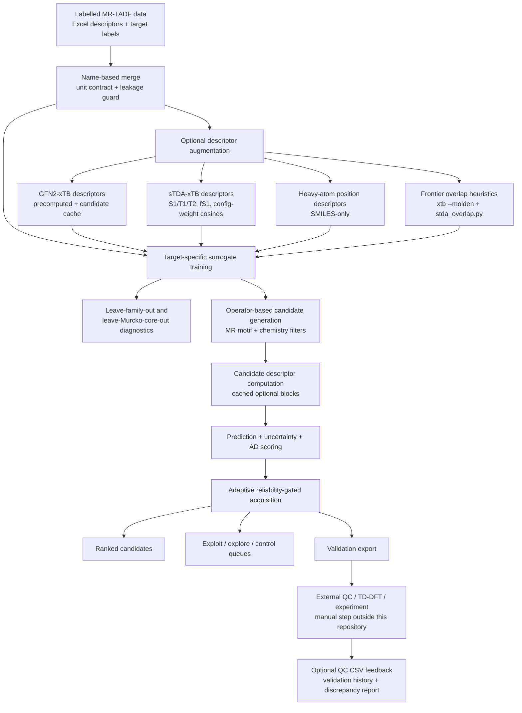
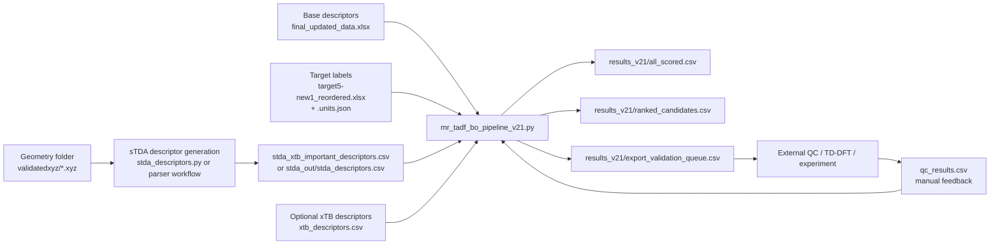

# Inverse design MR-TADF Pipeline

**Reliability-gated inverse design and semiempirical descriptor workflows for multi-resonance TADF candidate prioritisation**


---

## Repository summary

This repository contains a research-oriented Python workflow for **MR-TADF molecular candidate generation, surrogate prediction, reliability-gated ranking, and validation-queue export**.

The core script, `mr_tadf_bo_pipeline.py`, trains target-specific surrogate models from user-provided labelled molecular data, generates chemically filtered candidate structures by rule-based graph edits, scores them with uncertainty-aware acquisition logic, and writes ranked candidate tables for external quantum-chemical or experimental validation.

The repository also includes utilities for computing or parsing **sTDA-xTB excited-state descriptors** and **frontier-orbital overlap heuristics** used as optional feature blocks.

> **Important scope statement:** this pipeline is a **proposal and prioritisation engine**. It does **not** perform DFT, TD-DFT, spin-orbit coupling calculations, or experimental validation by itself. Validation is explicitly external/manual and can be fed back through CSV files.

---

## Why this repository exists

MR-TADF emitter design requires balancing multiple quantities that are difficult to optimise simultaneously:

- small or controlled `DeltaEST`
- suitable `T2-T1`
- non-negligible oscillator strength
- useful singlet energy window
- potentially useful SOC channels
- chemical plausibility and applicability-domain support

This codebase provides an implementation-oriented workflow for turning a labelled MR-TADF corpus into:

1. surrogate models for several photophysical targets,
2. rule-generated candidate molecules,
3. uncertainty- and applicability-domain-aware rankings,
4. exploitation / exploration / control queues for the next external validation round,
5. audit files documenting descriptor health, cross-validation behaviour, and ranking decisions.

---

## Graphical abstract



---

## Repository scope

### Implemented in code

| Area | Implemented behaviour |
|---|---|
| Data loading | Reads descriptor and target Excel files, normalises `Name`, merges by `Name`, removes potentially leaky descriptor columns, handles duplicate-name conflicts. |
| Unit handling | Requires or verifies unit sidecars for labelled target/QC/benchmark files unless explicitly bypassed. |
| Surrogate modelling | Supports GPR, bagged XGBoost, stacked XGB+Ridge, target-specific feature selection, and special SOC handling. |
| SOC modelling | Default two-stage hurdle SOC model with classifier for active SOC and regressor on active rows; asinh transform remains available for SOC targets. |
| Candidate generation | Uses operator-based graph edits, MR motif filters, synthetic-accessibility heuristic, retrosynthetic pattern filter, charge/radical rejection, diversity controls. |
| Descriptor augmentation | Optional xTB, sTDA-xTB, heavy-atom-position, and frontier-overlap descriptor blocks. |
| Ranking | Computes uncertainty-aware acquisition scores, AD penalties, feasibility factors, final scores, diversity-selected shortlists, and queue labels. |
| Diagnostics | Writes cross-validation reports, feature-importance summaries, descriptor-health metadata, plots, reproducibility metadata, and validation-history JSON. |


---

## Main components

| File | Role |
|---|---|
| `mr_tadf_bo_pipeline_v21.py` | Main inverse-design pipeline. Loads training data, trains surrogates, generates candidates, computes descriptors, scores/ranks candidates, writes queues and diagnostics. |
| `stda_descriptors.py` | Runs `xtb4stda` and `stda` over `validatedxyz/`, derives broader sTDA excited-state descriptors, writes descriptor CSV, manifest, correlations, cache, and failures. |
| `parse_stda_xtb_important_descriptors.py` | Parses existing sTDA output folders into a compact numeric descriptor table focused on important excited-state features for SOC modelling. |
| `stda_overlap.py` | Parses modern `xtb --molden` files and computes frontier coefficient-overlap, charge-transfer-length, transition-dipole proxy, and ζ-weighted frontier-density descriptors. |
| `a5.sh` | SLURM example for a full v21 inverse-design run on a Linux cluster. |
| `run_v21_local.ps1` | Reduced local Windows/PowerShell example run. |
| `run_stda_xtb_important_folder.sh` | SLURM helper intended to loop over `.xyz` files, run xTB/sTDA, and parse important descriptors. See the usage note below. |
| `target5-new1_reordered.xlsx.units.json` | Unit contract sidecar for the target-label Excel file. |
| `final_updated_data.xlsx` | Example descriptor table used by the provided run scripts. |
| `target5-new1_reordered.xlsx` | Example target-label table used by the provided run scripts. |
| `xtb_descriptors.csv` | Example precomputed xTB descriptor table. |
| `stda_xtb_important_descriptors.csv` | Example precomputed compact sTDA-xTB descriptor table. |

---

## Combined workflow concept

The intended workflow is file-based rather than fully orchestrated:



The scripts can be used together, but they are not a single automated closed-loop active-learning system. The validation loop is closed manually by selecting candidates, running external calculations or measurements, and re-running the pipeline with `--qc_results_file`.

---

## Highlights

- **Adaptive objective logic:** `DeltaEST` and singlet-window feasibility are always active under `--objective adaptive`; `fOSC` and `T2-T1` are enabled only where target-specific evidence supports them.
- **SOC is treated cautiously:** default SOC modelling uses a hurdle model, but under the adaptive objective SOC is reported for screening rather than used as a hard optimisation driver.
- **Descriptor-health auditing:** optional descriptor blocks are tracked for real-value fraction; mostly imputed blocks are warned about or can be made fatal with `--strict_descriptors`.
- **Applicability-domain gating:** candidate scores include descriptor distance, fingerprint similarity, core similarity, and uncertainty terms.
- **External validation design:** output queues are explicitly labelled as candidates to compute or measure next, not as validated discoveries.
- **Deterministic output schema:** scored/ranked CSVs use a canonical column ordering with optional extras appended.

---

## Data model

### Base descriptor file

The main pipeline expects an Excel descriptor file such as:

```text id="hdy9hw"
final_updated_data.xlsx
```

The loader renames the first two columns to:

```text id="8xx0j1"
Name
SMILES
```

The provided example file uses `Name` and `smile`; the loader renames the second column internally.

### Target file

The target Excel file is expected to contain a first column used as `Name` plus target columns including:

| Target column | Meaning in pipeline |
|---|---|
| `DeltaEST` | S1-T1 gap target |
| `T2-T1` | T2-T1 energy gap target |
| `T1-S1(SOC)` | SOC target for T1/S1 |
| `T2-S1(SOC)` | SOC target for T2/S1 |
| `Oscillator Strengths` | Oscillator strength target, reported as `OscStr` in output columns |
| `Singlets` | Singlet energy target |

The provided unit contract declares:

| Quantity | Unit |
|---|---|
| `DeltaEST` | eV |
| `T2-T1` | eV |
| `Singlets` | eV |
| `T1-S1(SOC)` | cm⁻¹ |
| `T2-S1(SOC)` | cm⁻¹ |
| `Oscillator Strengths` | dimensionless |

By default, labelled target/QC/benchmark files are expected to have hash-bound unit contract sidecars. Legacy bypass flags exist, but using them weakens provenance.

---

## Detailed workflow 1: main inverse-design pipeline

### Purpose

`mr_tadf_bo_pipeline.py` trains surrogate models and proposes MR-TADF candidates for external validation.

### Core operations

1. Load base descriptors and targets.
2. Verify declared target units.
3. Remove descriptor columns that appear to leak target information.
4. Optionally merge precomputed xTB and sTDA-xTB descriptor CSVs by `Name`.
5. Optionally append SMILES-only heavy-atom-position descriptors.
6. Optionally compute frontier-overlap descriptors from `xtb --molden`.
7. Train independent target surrogates.
8. Run leave-scaffold-family-out and strict leave-Murcko-core-out diagnostics.
9. Generate candidate structures by graph edit operators.
10. Compute candidate descriptors and descriptor-health flags.
11. Predict target values and uncertainties.
12. Score with feasibility, AD, novelty, trust, and diversity logic.
13. Export ranked candidates and validation queues.
14. Optionally merge external QC results and append validation-history records.

### Surrogate model options

| Option | Behaviour |
|---|---|
| default | Bagged XGBoost-style ensemble path for standard targets. |
| `--use_gpr` | Uses Gaussian process regression for non-SOC targets. |
| `--gp_alpha` | Sets the GPR diagonal ridge/noise floor; default is designed to reduce overfitting. |
| `--enable_stacking` | Uses XGB bagging followed by a ridge meta-learner for non-SOC targets. Mutually exclusive with `--use_gpr`. |
| `--soc_hurdle` | Default-on two-stage SOC model. |
| `--no_soc_hurdle` | Falls back to the older single-regressor SOC path. |
| `--asinh_soc` / `--no_asinh_soc` | Enables/disables signed-log treatment for SOC targets in relevant paths. |

### Candidate-generation logic

The generator is operator-based. It includes:

- heteroatom substitutions such as C/N and chalcogen substitutions,
- optional bulky substituent operations,
- optional diaza edits,
- optional annulation,
- ν-DABNA-style BN annulation logic,
- P-chalcogenide insertion motifs,
- donor/graft operations.

Candidates are filtered for:

- allowed atom sets,
- MR-defining motifs,
- aromatic ring count,
- heavy-atom range,
- rotatable-bond cap with donor-graft relaxation,
- charge/radical/open-shell rejection,
- heuristic retrosynthetic feasibility,
- corpus-relative synthetic-accessibility score.

The synthetic-accessibility score is local-corpus-relative and Ertl-Schuffenhauer-inspired. It is **not** the canonical published SAscore.

### Adaptive objective logic

Under:

```bash id="ui0xaz"
--objective adaptive
```

the code applies the following policy:

| Axis | Role |
|---|---|
| `DeltaEST` | Always active. |
| `Singlets` | Always constrained to the singlet energy window. |
| `fOSC` | Optional; enabled only with sufficient target-specific local reliability evidence. |
| `T2-T1` | Optional; enabled only with sufficient target-specific local reliability evidence. |
| SOC targets | Predicted and reported, but deferred to external validation under the adaptive objective. |

The optional axes are gated by factors including:

- exact Murcko-core support,
- target-specific applicability-domain score,
- strict-core out-of-fold reliability,
- held-out exact-core MAE behaviour,
- configured thresholds such as `--adaptive_min_ad`.

### Main outputs

A typical output directory such as `results_v21/` may contain:

| Output | Meaning |
|---|---|
| `all_scored.csv` | Full scored candidate audit table. |
| `ranked_candidates.csv` | Ranked candidates after scoring and ranking filters. |
| `top_diverse_candidates.csv` | Diversity-selected shortlist. |
| `top50_candidates.csv` | Top 50 ranked candidates. |
| `queue_exploit.csv` | High-final-score AD-clean candidates. |
| `queue_explore.csv` | High-novelty AD-clean candidates. |
| `queue_control.csv` | Familiar/control candidates near seed/core chemistry. |
| `export_validation_queue.csv` | Compact file intended for external validation selection. |
| `topology_summary.csv` | Topological novelty and core descriptor summary. |
| `infeasible_candidates.csv` | Written when all candidates fail feasibility gates. |
| `metadata.json` | Run metadata, descriptor health, validation mode, ranking settings. |
| `publication_diagnostics.json` | Publication-style run summary. |
| `reproducibility_manifest.json` | Input/source/executable provenance summary. |
| `scaffold_stratified_cv.json` | Leave-scaffold-family-out diagnostics. |
| `core_split_cv.json` | Strict leave-Murcko-core-out diagnostics. |
| `adaptive_axis_training_only_core_cv.json` | Optional-axis reliability evidence when split calibration is used. |
| `residual_covariance.json` | Out-of-fold residual covariance, if enabled. |
| `uncertainty_error_correlation.json` | OOF uncertainty/error association diagnostics. |
| `feature_importance_summary.json` | Feature-importance summary where available. |
| `conformal_kappa.json` | Global conformal scale factors, if calibration is enabled. |
| `conformal_kappa_by_scaffold.json` | Per-scaffold conformal scale factors, if enabled. |
| `conformal_support.json` | Scope/support summary for conformal intervals. |
| `validation_history.json` | Persistent active-learning history across runs. |
| `validation_merged_results.csv` | Candidate shortlist with matched external QC results, if supplied. |
| `qc_discrepancy_summary.json` | QC-vs-surrogate discrepancy summary, if QC is supplied. |
| `benchmark_predictions.csv` | Benchmark predictions, if a benchmark file is supplied. |
| `benchmark_metrics.json` | Benchmark metrics when labelled benchmark targets are available. |
| `novelty_vs_AD.png` | Diagnostic plot. |
| `parent_core_vs_score.png` | Diagnostic plot. |
| `scaffold_family_barplot.png` | Diagnostic plot. |

---

## Detailed workflow 2: compact sTDA-xTB important descriptor parser

### Script

```text id="e8g63e"
parse_stda_xtb_important_descriptors.py
```

### Purpose

Parses existing sTDA work directories into a compact numeric descriptor CSV focused on excited-state features useful for downstream modelling, especially SOC-related surrogate features.

### Expected files per molecule work directory

```text id="5zvrnb"
tda_singlet.dat
tda_triplet.dat
stda_singlet.out
stda_triplet.out
```

### Descriptors produced

| Descriptor group | Columns |
|---|---|
| Vertical energies | `S1_stda_xtb_eV`, `T1_stda_xtb_eV`, `T2_stda_xtb_eV` |
| Derived gaps | `DeltaEST_stda_xtb_eV`, `T2_T1_stda_xtb_eV` |
| Oscillator strength | `fS1_stda_xtb` |
| Configuration character | `S1_T1_config_weight_cosine`, `S1_T2_config_weight_cosine`, mismatch columns |
| Configuration complexity | entropy, dominant-weight, and count-above-threshold columns |

The configuration-weight cosine values are similarities between normalised squared-amplitude configuration-weight distributions. They are **not** signed CI-vector overlaps, wavefunction overlaps, or transition-density overlaps.

### One-molecule command

```bash id="o5twik"
python parse_stda_xtb_important_descriptors.py \
  --name 44-OQAO \
  --workdir stda_xtb_test/44-OQAO \
  --out stda_xtb_important_descriptors.csv \
  --append \
  --ewin 10 \
  --xtb4stda /path/to/xtb4stda \
  --stda /path/to/stda
```

### Folder command

```bash id="2u7mjm"
python parse_stda_xtb_important_descriptors.py \
  --root stda_xtb_test \
  --out stda_xtb_important_descriptors.csv \
  --ewin 10 \
  --xtb4stda /path/to/xtb4stda \
  --stda /path/to/stda
```

### Outputs

| Output | Meaning |
|---|---|
| `stda_xtb_important_descriptors.csv` | Compact descriptor table. |
| `stda_xtb_important_descriptors.csv.manifest.json` | Provenance sidecar with parser, executable, source-output, and energy-window hashes/settings. |

### Usage note for `run_stda_xtb_important_folder.sh`

The provided SLURM helper is intended to loop over `validatedxyz/*.xyz`, run xTB/sTDA, and call the parser per molecule. However, the parser as provided requires:

```text id="8t99fw"
--ewin
--xtb4stda
--stda
```

The uploaded `run_stda_xtb_important_folder.sh` parser call does not pass those required arguments. Patch the parser call or use the direct parser commands above to avoid an argument error.

---

## Detailed workflow 3: broader sTDA-xTB descriptor generation

### Script

```text id="ixv732"
stda_descriptors.py
```

### Purpose

Runs `xtb4stda` and `stda` directly over an `.xyz` geometry folder, derives semiempirical excited-state descriptors, and computes correlations with target labels.

This script is broader than the compact parser workflow and writes its own output folder.

### Typical commands

Quick test:

```bash id="mskh87"
python stda_descriptors.py \
  --xyz_dir validatedxyz \
  --target target5-new1_reordered.xlsx \
  --out stda_out \
  --limit 5
```

Full run:

```bash id="bnkxak"
python stda_descriptors.py \
  --xyz_dir validatedxyz \
  --target target5-new1_reordered.xlsx \
  --out stda_out \
  --workers 6 \
  --omp_threads 2 \
  --ewin 10
```

With explicit executables:

```bash id="gjg4wv"
python stda_descriptors.py \
  --xyz_dir validatedxyz \
  --target target5-new1_reordered.xlsx \
  --out stda_out \
  --xtb4stda /path/to/xtb4stda \
  --stda /path/to/stda \
  --workers 6
```

### Outputs

| Output | Meaning |
|---|---|
| `stda_out/stda_descriptors.csv` | One descriptor row per successful molecule. |
| `stda_out/stda_descriptors.csv.manifest.json` | Descriptor provenance manifest. |
| `stda_out/stda_target_correlations.csv` | Pearson/Spearman correlations against available target labels. |
| `stda_out/stda_failures.txt` | Failed molecules and errors. |
| `stda_out/stda_cache/*.json` | Manifest-keyed per-molecule descriptor cache. |

### Interpretation

sTDA-xTB descriptors can provide inexpensive excited-state correlates such as vertical S1/T1/T2 energies and S1 oscillator strength. The script does **not** compute SOC matrix elements.

---

## Detailed workflow 4: frontier-overlap heuristics

### Script

```text id="7bmo4b"
stda_overlap.py
```

### Purpose

Parses Molden files produced by modern:

```bash id="aemmqs"
xtb --molden
```

and computes fast frontier-orbital screening descriptors.

### Descriptor families

| Family | Examples |
|---|---|
| Frontier overlap | `Lambda_HL`, `Lambda_HLp1` |
| Charge-transfer length | `dr_HL_ang`, `dr_HLp1_ang` |
| ζ-weighted SOC proxy | `soc_homo_zeta_rho`, `soc_lumo_zeta_rho`, `soc_geom_zeta_rho` |
| Heavy frontier density | `soc_heavy_frontier_frac` |
| Transition-dipole proxy | `mu_HL_eA`, `fosc_HL_proxy`, `qnorm_HL` |

### Critical limitation

These descriptors are atom-condensed MO-coefficient heuristics. Molden files do not provide the AO overlap matrix used by rigorous Mulliken/Löwdin population analysis, so these values should be interpreted as **screening features**, not quantitative orbital-overlap observables.

---

## Suggested repository layout

```text id="f4oes7"
.
├── README.md
├── mr_tadf_bo_pipeline_v21.py
├── stda_descriptors.py
├── parse_stda_xtb_important_descriptors.py
├── stda_overlap.py
├── descriptor_provenance.py              # required by descriptor manifest code; include in repo
├── xtb_descriptors.py                    # referenced by pipeline for xTB features; include if using xTB block
├── a5.sh
├── run_v21_local.ps1
├── run_stda_xtb_important_folder.sh
├── data/
│   ├── final_updated_data.xlsx
│   ├── target5-new1_reordered.xlsx
│   └── target5-new1_reordered.xlsx.units.json
├── descriptors/
│   ├── xtb_descriptors.csv
│   ├── xtb_descriptors.csv.manifest.json
│   ├── stda_xtb_important_descriptors.csv
│   └── stda_xtb_important_descriptors.csv.manifest.json
├── validatedxyz/
│   └── <Name>.xyz
├── results_v21/
│   └── ...
└── environment.yml
```

The provided upload includes descriptor CSVs but not their `.manifest.json` sidecars. The main pipeline can be run with the explicit legacy bypass flag `--allow_unverified_descriptor_csv`, but publication runs should regenerate or provide manifest sidecars.

---

## Suggested software environment

### Python packages

The scripts require the following non-standard Python packages:

```text id="vko4hw"
numpy
pandas
scipy
scikit-learn
xgboost
matplotlib
rdkit
openpyxl
```

`openpyxl` is needed by pandas for Excel input/output support.

Optional or context-dependent:

```text id="7ko9ej"
psutil
torch
selfies
```

`torch` and `selfies` are imported defensively in the main pipeline, but the deep generative stack is documented as removed in v18 and is not part of the implemented v21 workflow.

### Local repository modules

The provided scripts reference local modules that should be included for complete functionality:

```text id="htj3k5"
descriptor_provenance.py
xtb_descriptors.py
stda_overlap.py
parse_stda_xtb_important_descriptors.py
stda_descriptors.py
```

`descriptor_provenance.py` and `xtb_descriptors.py` are referenced by the code but were not among the uploaded `.py` files. Include them in the repository if using descriptor provenance checks and xTB descriptor augmentation.

### External executables

Optional descriptor workflows require external command-line tools:

| Executable | Used by |
|---|---|
| `xtb` | xTB descriptors, candidate geometry optimisation, Molden overlap descriptors |
| `xtb4stda` | sTDA-xTB wavefunction preparation |
| `stda` | sTDA singlet/triplet calculations |

The cluster scripts assume a conda environment named `inverteddesign` and a SLURM-based HPC system. Adjust those names for your local installation.

## Option
---
1. Input, output, and run size
Option	Default	Explanation
`--data`	`updated_data.xlsx`	Main molecule/training-data file.
`--target`	`target5.xlsx`	Target-label file containing properties such as `DeltaEST`, `T2-T1`, `OscStr`, SOC, and `Singlets`.
`--seed_file`	`None`	Optional separate seed SMILES file, either `.txt` or `.xlsx`. If omitted, seeds are taken from the main data.
`--benchmark_file`	`None`	External benchmark molecule file for prediction or validation reporting.
`--n_candidates`	`10000`	Number of valid generated candidates to keep before scoring and ranking.
`--n_workers`	`0`	Number of multiprocessing workers. `0` means auto-detect.
`--attempts_per_worker`	`500000`	Maximum generation attempts per worker. Increase this if many generated structures fail chemistry filters.
`--n_ensemble`	`20`	Number of models in the deployed bagged ensemble. Higher values usually improve stability but increase runtime.
`--output`	`results`	Output directory for ranked candidates, metadata, reports, plots, and queue files.
`--max_train_threads`	`0`	Maximum threads used for model training. `0` means no explicit cap or automatic behaviour.
---
2. Candidate generation and chemistry-edit controls
Option	Default	Explanation
`--exploratory`	off	Expands the chemistry search space beyond default conservative edits. This admits more exploratory substitutions and atoms.
`--enable_bulky`	off	Enables bulky substituent generation. Useful when steric control is part of the design strategy.
`--enable_diaza`	off	Enables two-atom aza-style substitutions.
`--enable_annulation`	off	Enables the real benzannulation operator.
`--novelty_mode`	`balanced`	Controls novelty strictness. Choices: `conservative`, `balanced`, `exploratory`. Conservative keeps candidates closer to known chemistry; exploratory allows broader novelty.
---
3. Similarity, novelty, and diversity controls
Option	Default	Explanation
`--min_core_sim_parent`	`0.70`	Minimum core similarity to the parent seed. Higher values keep candidates closer to their parent core.
`--min_core_sim_train`	`0.60`	Minimum core similarity to training molecules. Higher values enforce a stronger applicability-domain requirement.
`--max_whole_sim_train`	`0.95`	Maximum whole-molecule similarity to any training molecule. Prevents near-duplicate rediscovery.
`--diversity_lambda`	`0.3`	Strength of diversity preference in final selection. Higher values favour chemically diverse selections.
`--top_diverse_n`	`50`	Number of candidates written to the top-diverse output.
`--max_per_parent`	`10`	Maximum number of selected candidates allowed from a single parent seed.
`--max_per_scaffold_family`	`30`	Maximum number of selected candidates allowed from one scaffold family.
---
4. Main ranking objective
Option	Default	Explanation
`--objective`	`adaptive`	Acquisition or ranking objective. Choices: `adaptive`, `dEST`, `TADF_FoM`, `dEST_fOSC`.
Objective meanings:
Objective	Meaning
`adaptive`	Default and most reliability-aware. It always considers small `DeltaEST` and the singlet-energy window. It only allows optional axes such as `fOSC` and `T2-T1` to influence ranking when local reliability checks pass.
`dEST`	Legacy single-target style objective focused mainly on minimising `DeltaEST`.
`dEST_fOSC`	Uses small `DeltaEST` and high oscillator strength. SOC is not used as a hard gate in this mode, making it safer when SOC predictions are unreliable.
`TADF_FoM`	Full physics-inspired TADF figure of merit. More aggressive because it uses SOC terms, so it should be used only when SOC modelling is sufficiently reliable.
---
5. Adaptive-objective reliability controls
These options mainly affect `--objective adaptive`.
Option	Default	Explanation
`--singlet_min_eV`	`2.0`	Lower edge of the target singlet-energy window in eV.
`--singlet_max_eV`	`3.5`	Upper edge of the target singlet-energy window in eV.
`--adaptive_min_ad`	`0.25`	Minimum applicability-domain score required before optional axes such as `fOSC` and `T2-T1` can influence adaptive ranking.
`--adaptive_min_core_train`	`2`	Minimum number of exact-Murcko-core training rows required before optional adaptive axes may be used.
`--adaptive_min_axis_oof_r2`	`0.0`	Minimum strict leave-one-Murcko-core-out pooled OOF R² required before an optional target axis can influence ranking.
`--adaptive_max_core_mae_factor`	`1.5`	Held-out exact-core MAE must be no worse than this multiple of pooled strict-core OOF MAE.
`--adaptive_min_core_eval`	`2`	Minimum labelled rows in a held-out exact-core fold before that core can be judged for local reliability.
`--adaptive_joint_mc_samples`	`4096`	Number of Monte Carlo samples for correlated joint feasibility probability when residual covariance is enabled.
---
6. Physical constraint thresholds
Option	Default	Explanation
`--T2_T1_CONSTRAINT`	`0.40`	Upper bound on `T2-T1`, in the chosen energy units. Smaller values favour stronger T2-mediated RISC feasibility.
`--fosc_min`	`0.01`	Minimum oscillator strength gate. Higher values favour brighter candidates.
`--soc1_min`	`0.01`	Minimum `T1-S1` SOC gate, in the chosen SOC units. Not used in `dEST_fOSC`.
`--soc2_min`	`0.05`	Minimum `T2-S1` SOC gate, in the chosen SOC units. Not used in `dEST_fOSC`.
`--gap_max_eV`	`0.5`	Maximum physically useful `DeltaEST` feasibility ceiling in eV. Default non-inverted regime requires `0 <= DeltaEST <= gap_max_eV`.
`--allow_inverted_singlet`	off	Opts into inverted-singlet design, where `S1 < T1` is allowed and small `
---
7. Unit options
Option	Default	Explanation
`--energy_units`	`eV`	Units of `DeltaEST`, `T2-T1`, and `Singlets` columns in the target file. Supported values: `eV`, `meV`, `cm-1`, `kcal/mol`, `kJ/mol`, `hartree`.
`--soc_units`	`cm-1`	Units of SOC columns. Supported values: `cm-1`, `meV`, `eV`, `hartree`.
---
8. Surrogate model options
Option	Default	Explanation
`--use_gpr`	off	Uses Gaussian Process Regression for non-SOC targets instead of bagged XGB. Recommended mainly for small datasets.
`--gp_alpha`	`0.1`	GP regularisation/noise floor. Larger values reduce interpolation and overfitting risk.
`--enable_stacking`	off	Uses a stacked ensemble: XGB bag predictions feed a Ridge meta-learner. Mutually exclusive with `--use_gpr`.
`--stacking_alpha`	`1.0`	Ridge regularisation strength for the stacking meta-learner.
`--soc_xgb`	on	Forces SOC targets to use bagged XGB even if other targets use GPR or stacking. This is default because SOC targets are heavy-tailed and difficult for GPR/stacking.
`--no_soc_xgb`	off	Makes SOC use the same surrogate family as the non-SOC targets.
---
9. Uncertainty calibration and cross-validation
Option	Default	Explanation
`--calibrate_sigma`	off	Holds out 20% of training data and computes conformal scaling to make predictive uncertainty more realistic.
`--scaffold_conformal`	off	Adds per-scaffold-family conformal calibration with global fallback. Requires `--calibrate_sigma`.
`--scaffold_cv`	off	Runs leave-family-out cross-validation per target and writes a scaffold-stratified report.
`--core_split_cv_min_test`	`1`	Minimum held-out Murcko-core fold size. Default `1` includes singleton cores.
`--cv_n_ensemble`	`8`	Ensemble size used inside leave-group-out CV and y-scramble tests. Lower than the deployed ensemble for speed.
`--y_scramble_n`	`1`	Number of y-scramble / label-permutation baselines. Set to `0` to disable.
`--enable_residual_cov`	off	Uses out-of-fold residual covariance for correlated joint feasibility and correlated TADF-FoM Monte Carlo sampling. This is more realistic than assuming independent target errors.
---
10. Chemistry hard filters
Option	Default	Explanation
`--sascore_max`	`6.0`	Maximum allowed corpus-relative synthetic-accessibility heuristic score. Larger values allow harder or more unusual molecules.
`--disable_sa_filter`	off	Disables the synthetic-accessibility filter. Mostly useful for testing.
`--disable_retro_filter`	off	Disables the retrosynthesis-feasibility filter. Mostly useful for testing.
`--disable_charge_radical_filter`	off	Allows charged, radical, or open-shell species by disabling that rejection gate. Scientifically risky because the surrogate assumes neutral closed-shell molecules.
---
11. Applicability-domain gates and validation queues
Option	Default	Explanation
`--ad_hard_threshold`	`0.15`	Candidates below this AD score are rejected before ranking.
`--ad_soft_threshold`	`0.40`	Candidates between the hard and soft thresholds receive a trust penalty.
`--n_exploit`	`30`	Number of candidates in the exploitation queue: high-ranking, AD-clean candidates.
`--n_explore`	`30`	Number of candidates in the exploration queue: novelty-focused but still AD-clean candidates.
`--n_control`	`20`	Number of candidates in the control queue: close-to-seed comparators.
`--validation_history_file`	`None`	Persistent JSON file for top-N predictions and merged validation labels. Defaults to `<output>/validation_history.json`.
---
12. Label-source weighting
Option	Default	Explanation
`--label_source_col`	`None`	Column in the target file identifying the source of each label, such as `experimental`, `DFT`, or `literature`.
`--label_source_weights`	`None`	JSON mapping from source names to sample weights, for example `'{"experimental":2.0,"DFT":1.0}'`. Used mainly for XGB training.
Example:
```bash
--label_source_col source \
--label_source_weights '{"experimental":2.0,"DFT":1.0}'
```
---
13. External QC / validation merge
Option	Default	Explanation
`--qc_results_file`	`None`	CSV containing externally computed QC, DFT, TD-DFT, or experimental results. Must include a `smiles` column and any target columns to merge.
`--benchmark_file`	`None`	External benchmark molecule file for prediction/validation reporting.
Recommended workflow:
Run the pipeline.
Inspect `ranked_candidates.csv` and queue files.
Select candidates for external QC/DFT/experiment.
Save external results in a CSV with `smiles` plus target columns.
Re-run with `--qc_results_file your_qc_results.csv`.
Review merged validation and discrepancy reports.
---
14. xTB ground-state descriptor options
Option	Default	Explanation
`--use_xtb_descriptors`	off	Adds GFN2-xTB ground-state descriptors to the feature matrix. Training descriptors are read from file; candidate descriptors are computed on the fly and cached.
`--xtb_descriptors_file`	`xtb_out/xtb_descriptors.csv`	Precomputed xTB descriptor CSV for training molecules.
`--xtb_bin`	`None`	Path to the `xtb` executable. If omitted, the script attempts auto-detection.
`--xtb_cache`	`xtb_out/xtb_cache_cand`	Manifest-keyed cache directory for candidate xTB descriptors.
---
15. sTDA-xTB excited-state descriptor options
Option	Default	Explanation
`--use_stda_descriptors`	off	Adds sTDA-xTB excited-state descriptors such as S1/T1/T2 energies, fS1, configuration overlap, and entropy descriptors. This is one of the strongest feature-augmentation options in v21.
`--stda_descriptors_file`	`stda_xtb_important_descriptors.csv`	Precomputed training-set sTDA-xTB descriptor CSV.
`--stda_cache`	`stda_out/stda_cache_cand`	Manifest-keyed cache directory for candidate sTDA-xTB descriptors.
`--xtb4stda_bin`	`None`	Path to `xtb4stda`. If omitted, the script attempts auto-detection.
`--stda_bin`	`None`	Path to `stda`. If omitted, the script attempts auto-detection.
`--stda_ewin`	`10.0`	sTDA excited-state energy window in eV.
`--stda_timeout`	`600`	Per-molecule timeout in seconds for sTDA-related calculations.
---
16. SOC modelling options
Option	Default	Explanation
`--asinh_soc`	on	Trains SOC targets in asinh / signed-log space and transforms predictions back to linear SOC units. This helps with zero-spiked, heavy-tailed SOC distributions.
`--no_asinh_soc`	off	Disables the asinh SOC transform and uses legacy linear SOC targets.
`--soc_hurdle`	on	Uses a two-stage SOC model: classifier for whether SOC is appreciable, multiplied by a regressor for SOC magnitude when active.
`--no_soc_hurdle`	off	Disables the hurdle model and uses a single-regressor SOC path.
`--soc_active_threshold`	`0.5`	SOC threshold, in cm⁻¹, used to define large/active SOC for the hurdle classifier and screening columns.
`--use_heavy_pos`	on	Adds SMILES-only heavy-atom-position descriptors such as Se/Te/P counts, heavy-in-core fraction, and distances to MR core/acceptor.
`--no_heavy_pos`	off	Disables the heavy-atom-position descriptor block.
Practical interpretation: v21 treats SOC as difficult and distributionally unusual. The default combination of `--asinh_soc`, `--soc_xgb`, `--soc_hurdle`, and `--use_heavy_pos` is designed to make SOC modelling more robust.
---
17. Overlap / frontier-descriptor options
Option	Default	Explanation
`--use_overlap_descriptors`	off	Adds frontier atom-condensed coefficient and overlap-style descriptors from `xtb --molden`. Slower, but may improve physically relevant feature representation.
`--no_overlap_descriptors`	off	Explicitly disables overlap descriptors. Default is already off.
`--overlap_xyz_dir`	`validatedxyz`	Directory of training-set `<Name>.xyz` geometries for overlap descriptors. Falls back to RDKit embedding if missing.
`--overlap_cache`	`overlap_out/overlap_cache`	Manifest-keyed cache directory for overlap/molden descriptors.
---
18. Candidate geometry optimisation
Option	Default	Explanation
`--opt_candidate_geom`	auto / `None`	Forces GFN2-xTB optimisation of each candidate geometry before geometry-dependent descriptors. If not specified, the script auto-enables this when xTB/sTDA/overlap descriptors are active and `xtb` is available.
`--no_opt_candidate_geom`	off	Forces candidate geometries to remain at RDKit/MMFF level. Faster, but may increase mismatch between training and candidate descriptors.
---
19. Descriptor provenance, health, and safety checks
Option	Default	Explanation
`--min_descriptor_success`	`0.5`	Minimum fraction of rows where a descriptor block must have real, non-imputed values before it is trusted.
`--strict_descriptors`	off	Aborts the run if an enabled descriptor block falls below `--min_descriptor_success`. Without this flag, the pipeline warns and continues.
`--allow_unverified_descriptor_csv`	off	Legacy opt-out that allows xTB/sTDA descriptor CSVs without valid hash-verified manifest sidecars. Default is safer.
`--duplicate_conflict_policy`	`error`	How to handle duplicate `Name` keys with conflicting values. Choices: `error`, `first`.
`--allow_missing_unit_contract`	off	Legacy opt-out that allows labelled target/QC/benchmark files without hash-bound `.units.json` sidecar files. Default is safer.
---
20. Per-target feature selection
Option	Default	Explanation
`--select_features_targets`	`DeltaEST,T2-T1,OscStr,T1-S1(SOC),T2-S1(SOC)`	Comma-separated targets for which the model uses only selected top-k descriptors. Use an empty string to disable feature selection.
`--select_top_k`	`DeltaEST:40,T2-T1:40,OscStr:40,T1-S1(SOC):20,T2-S1(SOC):20`	Number of top descriptors retained per selected target. Can be a single integer for all targets or target-specific mappings.

---

## Quick start

### 1. Minimal smoke run without optional quantum descriptors

This is the simplest way to test the main pipeline logic.

```bash id="lm861l"
python mr_tadf_bo_pipeline.py \
  --data final_updated_data.xlsx \
  --target target5-new1_reordered.xlsx \
  --n_candidates 100 \
  --n_workers 4 \
  --attempts_per_worker 50000 \
  --n_ensemble 8 \
  --output results_smoke \
  --objective adaptive
```

This requires the target unit sidecar:

```text id="t1xmkh"
target5-new1_reordered.xlsx.units.json
```

### 2. Run with precomputed xTB and sTDA descriptor CSVs

Use this when descriptor manifests are available:

```bash id="t99r27"
python mr_tadf_bo_pipeline.py \
  --data final_updated_data.xlsx \
  --target target5-new1_reordered.xlsx \
  --n_candidates 500 \
  --n_workers 4 \
  --n_ensemble 20 \
  --output results_v21 \
  --objective adaptive \
  --use_gpr \
  --gp_alpha 0.1 \
  --use_xtb_descriptors \
  --xtb_descriptors_file xtb_descriptors.csv \
  --use_stda_descriptors \
  --stda_descriptors_file stda_xtb_important_descriptors.csv \
  --soc_hurdle \
  --use_heavy_pos
```

For legacy descriptor CSVs without manifest sidecars:

```bash id="mazs9u"
python mr_tadf_bo_pipeline.py \
  --data final_updated_data.xlsx \
  --target target5-new1_reordered.xlsx \
  --n_candidates 500 \
  --n_workers 4 \
  --n_ensemble 20 \
  --output results_v21 \
  --objective adaptive \
  --use_gpr \
  --gp_alpha 0.1 \
  --use_xtb_descriptors \
  --xtb_descriptors_file xtb_descriptors.csv \
  --use_stda_descriptors \
  --stda_descriptors_file stda_xtb_important_descriptors.csv \
  --soc_hurdle \
  --use_heavy_pos \
  --allow_unverified_descriptor_csv
```

Use the legacy bypass only when you understand that descriptor provenance is no longer established by the run.

### 3. Full SLURM example

```bash id="fkd0it"
sbatch a5.sh
```

The provided `a5.sh` enables:

- GPR with `--gp_alpha 0.1`,
- adaptive objective,
- xTB descriptors,
- sTDA descriptors,
- heavy-atom-position descriptors,
- overlap descriptors,
- candidate GFN2-xTB geometry optimisation,
- residual covariance,
- diversity limits.

This is a heavier run and assumes working `xtb`, `xtb4stda`, and `stda` paths.

### 4. Reduced local Windows example

```powershell id="downb7"
pwsh run_v21_local.ps1 60
```

To additionally request candidate geometry optimisation:

```powershell id="80dmta"
pwsh run_v21_local.ps1 60 -OptGeom
```

The local script uses hard-coded Windows paths. Edit `$PY` and `$XTB` before running on another system.

---

## Using the workflows together

### Step A: prepare labelled data

Place the base descriptor and target files in the working directory:

```text id="pe5bs6"
final_updated_data.xlsx
target5-new1_reordered.xlsx
target5-new1_reordered.xlsx.units.json
```

### Step B: prepare optional descriptor tables

Use one or more of:

```bash id="2pa24a"
python stda_descriptors.py --xyz_dir validatedxyz --out stda_out
```

or:

```bash id="s7eypg"
python parse_stda_xtb_important_descriptors.py \
  --root stda_xtb_test \
  --out stda_xtb_important_descriptors.csv \
  --ewin 10 \
  --xtb4stda /path/to/xtb4stda \
  --stda /path/to/stda
```

For xTB descriptors, the main script expects a producer named `xtb_descriptors.py` when `--use_xtb_descriptors` is active.

### Step C: run inverse design

```bash id="3tb0jc"
python mr_tadf_bo_pipeline.py \
  --data final_updated_data.xlsx \
  --target target5-new1_reordered.xlsx \
  --output results_v21 \
  --objective adaptive \
  --use_xtb_descriptors \
  --xtb_descriptors_file xtb_descriptors.csv \
  --use_stda_descriptors \
  --stda_descriptors_file stda_xtb_important_descriptors.csv
```

### Step D: inspect validation queue

Prioritise candidates from:

```text id="43r727"
results_v21/export_validation_queue.csv
results_v21/queue_exploit.csv
results_v21/queue_explore.csv
results_v21/queue_control.csv
```

### Step E: run external validation manually

Run DFT, TD-DFT, SOC calculations, or experiments outside this repository.

### Step F: feed results back

Prepare a CSV with a `smiles` column and any target columns to merge, for example:

```text id="kgtam6"
smiles,DeltaEST,T2-T1,Oscillator Strengths,Singlets,T1-S1(SOC),T2-S1(SOC)
...
```

Then re-run with:

```bash id="43ke6c"
python mr_tadf_bo_pipeline.py \
  --data final_updated_data.xlsx \
  --target target5-new1_reordered.xlsx \
  --qc_results_file qc_results.csv \
  --validation_history_file results_v21/validation_history.json \
  --output results_v21_next
```

QC files are also subject to unit-contract verification unless the legacy bypass is used.

---

## Reproducibility notes

The code includes several reproducibility and audit mechanisms:

- hash-bound unit contract checks for labelled files,
- descriptor CSV manifest verification,
- descriptor-health summaries,
- candidate descriptor-integrity gates,
- deterministic scored CSV schema,
- reproducibility manifest with input/source/executable records,
- leave-scaffold-family-out and strict leave-Murcko-core-out diagnostics,
- optional residual covariance from out-of-fold residuals,
- validation-history JSON across runs.

For publication use, keep the following files with each run:

```text id="hqwea5"
metadata.json
publication_diagnostics.json
reproducibility_manifest.json
scaffold_stratified_cv.json
core_split_cv.json
all_scored.csv
ranked_candidates.csv
export_validation_queue.csv
```

Also archive the exact input data, descriptor CSVs, descriptor manifests, unit contracts, and external executable versions.

---

## Confidence and decision logic

### Candidate confidence signals

The main ranked outputs include several columns that should be interpreted together:

| Column family | Interpretation |
|---|---|
| `pred_*` | Surrogate mean prediction. |
| `unc_*` | Model uncertainty estimate. |
| `AD_score` | Applicability-domain score combining descriptor distance, fingerprint/core similarity, and uncertainty. |
| `trust_parent`, `trust_train` | Similarity/trust penalties relative to parent and training chemistry. |
| `p_*` | Feasibility probability factors used by the acquisition/ranking logic. |
| `cei` | Constrained expected improvement-like acquisition value. |
| `final_score` | Integrated ranking score after acquisition, novelty, AD/trust, and other terms. |
| `validation_priority_score` | Score used for validation-priority export. |
| `queue` | Exploit, explore, control, or blank. |

### Queue interpretation

| Queue | Intended use |
|---|---|
| `exploit` | Highest-scoring AD-clean candidates for near-term validation. |
| `explore` | High-novelty candidates to expand chemical coverage. |
| `control` | Familiar candidates close to seed/core chemistry; useful for sanity-checking surrogate behaviour. |

Queue membership is not validation. It is a recommendation for external computation or measurement.

---

## Methodological contribution and interpretation

The codebase combines several methodological elements into a practical MR-TADF design workflow:

1. **Rule-based molecular proposal generation** within MR-like chemistry.
2. **Multi-target surrogate modelling** with target-specific reliability diagnostics.
3. **Descriptor augmentation** using low-cost xTB/sTDA-derived features.
4. **Cautious SOC modelling** through hurdle decomposition and heavy-atom-position descriptors.
5. **Adaptive acquisition** that avoids using poorly supported optional axes outside local reliability evidence.
6. **External validation handoff** through ranked queues and feedback CSV merging.

The most defensible interpretation of this repository is:

> a reproducible candidate-prioritisation workflow for deciding which MR-TADF molecules are worth validating next.

It should not be interpreted as a standalone discovery engine that validates final emitter performance.

---

## Limitations

- **No automatic validation:** the pipeline does not run DFT, TD-DFT, SOC, or experiments.
- **Surrogate predictions are corpus-dependent:** out-of-domain molecules may receive unreliable predictions even if they pass filters.
- **SOC remains difficult:** the hurdle model and screening scores are useful engineering devices, not a replacement for explicit SOC validation.
- **sTDA does not provide SOC:** sTDA descriptors are excited-state correlates, not SOC matrix elements.
- **Overlap descriptors are heuristic:** Molden parsing uses coefficient-condensed proxies without an AO overlap matrix.
- **Synthetic accessibility is local and heuristic:** the implemented score is corpus-relative and not a canonical SAscore.
- **Some helper scripts are environment-specific:** SLURM scripts assume a particular cluster module/conda setup; the PowerShell script contains local Windows paths.
---

## Acknowledgments

This repository builds on widely used scientific Python and computational chemistry tooling, including RDKit, NumPy, pandas, SciPy, scikit-learn, XGBoost, matplotlib, xTB, xtb4stda, and sTDA.

The workflow is designed for transparent candidate prioritisation and should be paired with independent quantum-chemical or experimental validation before making materials claims.

---
