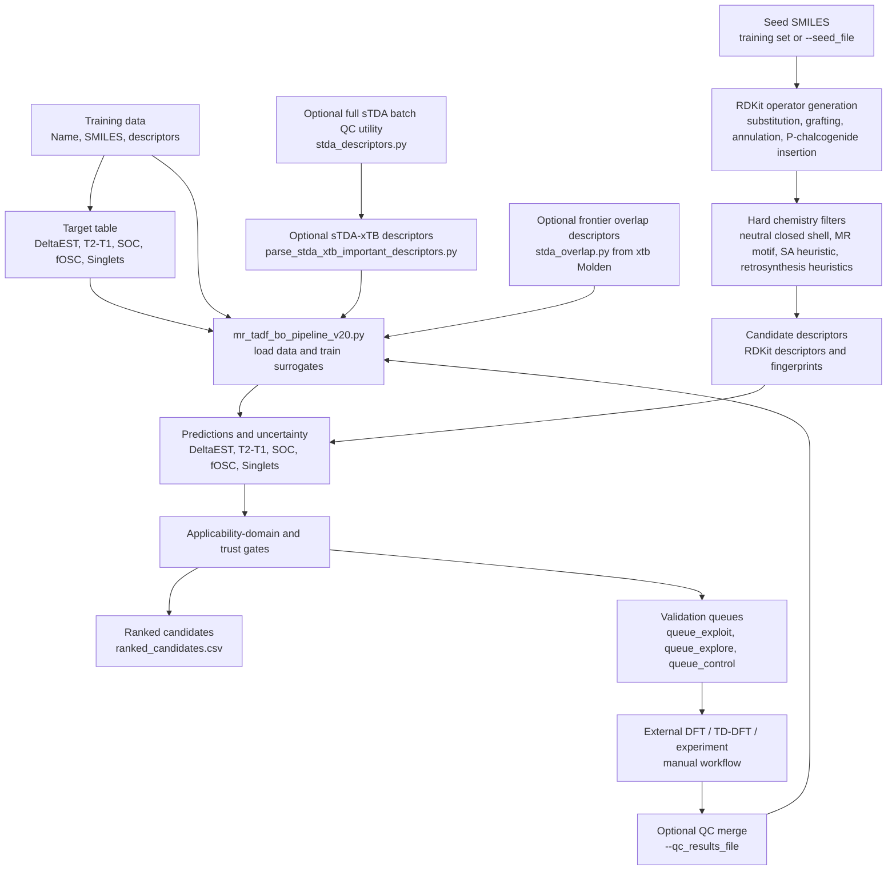

# MR-TADF Bayesian-Optimization Screening Pipeline

[](#suggested-software-environment)
[](#suggested-software-environment)
[](#stda-xtb-descriptor-workflow)
[](#repository-scope)
[](#recommended-additions-for-publication-readiness)

Publication-companion code for **multi-resonance thermally activated delayed fluorescence (MR-TADF)** candidate generation, descriptor augmentation, surrogate modelling, and ranked proposal of molecules for external quantum-chemical or experimental validation.

The repository contains a primary MR-TADF screening pipeline and three descriptor/parsing utilities for sTDA-xTB and frontier-orbital overlap features. The code is designed for **proposal generation and prioritisation**, not for automatic DFT/TD-DFT validation.

---

## Why this repository exists

MR-TADF molecular discovery requires balancing several coupled excited-state properties:

- small singlet-triplet gap, `DeltaEST`
- small `T2-T1`
- usable oscillator strength
- spin-orbit-coupling indicators
- structural novelty while remaining within a chemically meaningful design domain

This repository implements a practical screening workflow that:

1. starts from labelled MR-TADF data and seed SMILES,
2. generates chemically filtered candidate structures using RDKit edit operators,
3. trains per-target surrogate models,
4. optionally augments features with xTB/sTDA-derived descriptors,
5. reports out-of-fold generalisation diagnostics,
6. ranks candidates into validation queues for external QC or experiment.

The validation loop is intentionally external: the pipeline recommends molecules, but the user must run DFT/TD-DFT or experiments separately and optionally feed results back through `--qc_results_file`.

---

## Graphical abstract / conceptual workflow



> The diagram is conceptual. The provided scripts do not form a single fully orchestrated QC workflow. File handoff between descriptor generation, surrogate screening, and external validation is manual or command-line based.

---

## Repository scope

| Scope item | Implemented in code? | Notes |
|---|---:|---|
| RDKit-based MR-TADF candidate generation | Yes | Operator-based mutation of seed molecules. |
| Chemistry hard filters | Yes | Neutral/closed-shell filtering, allowed elements, MR motif checks, corpus-relative SA heuristic, retrosynthesis-pattern rejection. |
| Surrogate modelling | Yes | Bagged XGBoost, optional Gaussian process, optional stacking for non-SOC targets, SOC-specific hurdle model. |
| Leave-family-out and Murcko-core CV diagnostics | Yes | Written each run by the main pipeline. |
| Candidate ranking and validation queues | Yes | Produces exploit, explore, and control queues. |
| sTDA-xTB descriptor parsing | Yes | Parser for pre-existing sTDA/xTB output folders. |
| sTDA-xTB execution over XYZ geometries | Yes | `stda_descriptors.py` runs `xtb4stda` and `stda`; parser format should be checked for the installed sTDA version. |
| Frontier HOMO/LUMO overlap descriptors from Molden | Yes | `stda_overlap.py` parses a Molden file and emits JSON descriptors. |
| Automatic DFT/TD-DFT validation | No | Explicitly external/manual. |
| Automatic synthesis planning | No | Only heuristic accessibility and retrosynthesis filters are implemented. |
| Deep generative models | No | The main script notes that prior VAE/flow/diffusion/RL code was removed. |
| Ground-state xTB descriptor script | Referenced, not provided here | `mr_tadf_bo_pipeline_v20.py` can import `xtb_descriptors.py`, but that file is not among the provided scripts. |

---

## Components

| File | Role | Main inputs | Main outputs |
|---|---|---|---|
| `mr_tadf_bo_pipeline_v20.py` | Main MR-TADF candidate generation, surrogate training, scoring, ranking, diagnostics, and queue export | Descriptor Excel file, target Excel file, optional seed SMILES, optional sTDA/xTB descriptor CSVs | Ranked CSVs, queues, CV JSON reports, parity plots, metadata, diagnostics |
| `parse_stda_xtb_important_descriptors.py` | Minimal parser for existing sTDA-xTB folders | `tda_singlet.dat`, `tda_triplet.dat`, `stda_singlet.out`, `stda_triplet.out` | `stda_xtb_important_descriptors.csv` |
| `stda_descriptors.py` | Batch runner for `xtb4stda → stda` over XYZ geometries plus target-correlation report | `validatedxyz/*.xyz`, target Excel file, `xtb4stda`, `stda` executables | `stda_descriptors.csv`, `stda_target_correlations.csv`, cache JSON files, failure log |
| `stda_overlap.py` | Molden parser for frontier overlap, charge-transfer length, transition-dipole proxy, and SOC-proxy descriptors | Molden file from `xtb --molden` | JSON descriptor dictionary when run directly; Python dictionary when imported |

---

## Code-to-README validation note

This README is derived from inspection of the provided Python scripts only. It intentionally avoids claims that are not implemented in the supplied code. In particular:

- the main pipeline is a **surrogate proposal engine**, not an automated QC validator;
- sTDA/xTB and Molden descriptors are optional feature sources, not guaranteed to run unless the external executables and required helper modules are available;
- `stda_overlap.py` computes **frontier HOMO/LUMO proxies**, not rigorous state-resolved S1/T1/T2 transition-density descriptors;
- `stda_descriptors.py` contains a parser comment indicating that the exact sTDA stdout format should be verified against the installed version;
- the synthetic-accessibility score is corpus-relative and heuristic, not the canonical Ertl-Schuffenhauer SAscore.

---

## Main pipeline: `mr_tadf_bo_pipeline_v20.py`

### Purpose

`mr_tadf_bo_pipeline_v20.py` is the central screening script. It trains surrogate models on labelled MR-TADF data, generates new molecules from seed SMILES using chemically constrained RDKit edit operators, scores candidates, applies applicability-domain and trust gates, and exports ranked validation queues.

### Required data files

By default, the script expects:

```text
updated_data.xlsx
target5.xlsx
```

The descriptor file is read as:

- first column → `Name`
- second column → `SMILES`
- remaining columns → molecular descriptors

The target file is read as:

- first column → `Name`
- required target columns:
  - `DeltaEST`
  - `T2-T1`
  - `T1-S1(SOC)`
  - `T2-S1(SOC)`
  - `Oscillator Strengths`
  - `Singlets`

Rows are merged by `Name`. Rows with missing target values are dropped.

### Implemented modelling logic

The pipeline trains one surrogate per target:

| Target | Default treatment |
|---|---|
| `DeltaEST` | Bagged XGBoost unless `--use_gpr` or `--enable_stacking` is selected |
| `T2-T1` | Same non-SOC surrogate choice |
| `OscStr` | Same non-SOC surrogate choice |
| `Singlets` | Same non-SOC surrogate choice |
| `T1-S1(SOC)` | Default hurdle SOC model |
| `T2-S1(SOC)` | Default hurdle SOC model |

The default SOC path is a two-stage hurdle model:

```text
E[SOC] = P(SOC > threshold | x) × E[SOC | active, x]
```

The classifier estimates whether SOC is “large” relative to `--soc_active_threshold`, and the regressor estimates magnitude for active examples. SOC predictions are returned in linear units for output and scoring.

### Candidate generation

Candidate structures are generated from seed molecules using RDKit-based operators, including:

- fluorination
- methyl and tert-butyl substitution
- aromatic C/N and chalcogen substitutions
- paired substitutions
- donor grafting from an internal donor library
- cyano substitution
- sulfone oxidation
- sp³ quaternary bridge insertion
- optional benzannulation
- ν-DABNA-style BN rim extension
- P-chalcogenide insertion

The candidate generator rejects exact duplicates against seed and training molecules using InChI-based deduplication.

### Hard filters

The pipeline applies chemistry filters before scoring. These include:

- allowed element set checks;
- neutral closed-shell requirement;
- rejection of formal charges and radicals;
- MR motif and aromatic-ring requirements;
- rotatable-bond and heavy-atom-range constraints;
- corpus-relative synthetic-accessibility heuristic;
- retrosynthesis-pattern rejection for selected high-risk motifs.

These filters are heuristics intended to keep candidates inside the design domain. They are not a substitute for synthetic planning.

### Default objective

The default objective is:

```text
dEST_fOSC
```

This optimises a predictable-axis figure of merit:

```text
log10(fOSC) - 2·log10(DeltaEST)
```

The code reports SOC predictions and large-SOC probabilities, but under the default objective it does not directly optimise the SOC magnitude term. A full physics-inspired objective including SOC is available through:

```bash
--objective TADF_FoM
```

A legacy single-target objective is also available:

```bash
--objective dEST
```

### Applicability-domain and ranking logic

The ranking step applies:

- uncertainty filtering for `DeltaEST`;
- property filters for `DeltaEST` and `T2-T1`;
- parent and training-set trust gates;
- hard applicability-domain rejection;
- soft applicability-domain penalty;
- final diversity selection with parent and scaffold-family caps.

If no candidates pass the strict property filters, the code relaxes property thresholds while preserving trust and applicability-domain gates.

---

## sTDA-xTB descriptor workflow

Two scripts support sTDA-xTB descriptor generation and parsing.

### `parse_stda_xtb_important_descriptors.py`

This script parses already-computed sTDA-xTB output folders.

Each molecule work directory is expected to contain:

```text
tda_singlet.dat
tda_triplet.dat
stda_singlet.out
stda_triplet.out
```

The script writes a compact descriptor CSV with the following implemented columns:

```text
Name
S1_stda_xtb_eV
fS1_stda_xtb
T1_stda_xtb_eV
T2_stda_xtb_eV
DeltaEST_stda_xtb_eV
T2_T1_stda_xtb_eV
S1_T1_config_overlap
S1_T2_config_overlap
S1_T1_character_mismatch
S1_T2_character_mismatch
S1_config_entropy
T1_config_entropy
T2_config_entropy
S1_dominant_weight
T1_dominant_weight
T2_dominant_weight
S1_n_configs_ge_0p02
T1_n_configs_ge_0p02
T2_n_configs_ge_0p02
```

It intentionally does **not** output SOC labels. SOC remains a supervised target in the main target file.

Example:

```bash
python parse_stda_xtb_important_descriptors.py \
  --root stda_xtb_test \
  --out stda_xtb_important_descriptors.csv
```

For one molecule:

```bash
python parse_stda_xtb_important_descriptors.py \
  --name 44-OQAO \
  --workdir stda_xtb_test/44-OQAO \
  --out stda_xtb_important_descriptors.csv \
  --append
```

### `stda_descriptors.py`

This script runs `xtb4stda` and `stda` over XYZ geometries and computes a broader sTDA descriptor table plus descriptor-target correlations.

Default inputs:

```text
validatedxyz/*.xyz
target5-new1_reordered.xlsx
```

Default output directory:

```text
stda_out/
```

Implemented outputs:

```text
stda_out/stda_descriptors.csv
stda_out/stda_target_correlations.csv
stda_out/stda_failures.txt
stda_out/stda_cache/<Name>.json
```

Example quick test:

```bash
python stda_descriptors.py \
  --xyz_dir validatedxyz \
  --target target5-new1_reordered.xlsx \
  --out stda_out \
  --limit 5
```

Example larger run:

```bash
python stda_descriptors.py \
  --xyz_dir validatedxyz \
  --target target5-new1_reordered.xlsx \
  --out stda_out \
  --workers 6 \
  --omp_threads 2 \
  --ewin 10.0
```

---

## Frontier overlap workflow: `stda_overlap.py`

`stda_overlap.py` parses a Molden file produced by modern `xtb --molden` and computes atom-condensed frontier descriptors.

Implemented descriptor columns:

```text
Lambda_HL
dr_HL_ang
Lambda_HLp1
dr_HLp1_ang
soc_homo_zrho
soc_lumo_zrho
soc_geom_zrho
soc_max_atom_zrho
soc_heavy_frontier_frac
mu_HL_eA
fosc_HL_proxy
qnorm_HL
mu_HLp1_eA
fosc_HLp1_proxy
```

The descriptor logic is based on atom-condensed HOMO and LUMO populations:

```text
Lambda_HL = Σ_A sqrt(P_HOMO,A · P_LUMO,A)

dr_HL = |Σ_A P_LUMO,A r_A - Σ_A P_HOMO,A r_A|
```

The SOC-proxy columns use empirical valence one-electron SOC constants where tabulated and a Z² fallback for unlisted elements.

Run directly:

```bash
xtb molecule.xyz --molden

python stda_overlap.py molden.input
```

The script returns JSON. It does not run `xtb` itself.

---

## Combined workflow concept

A typical publication-style workflow is:

1. prepare labelled training files;
2. optionally compute sTDA-xTB descriptors for the training set;
3. optionally compute frontier-overlap descriptors from Molden files;
4. run the surrogate proposal pipeline;
5. inspect ranked candidates and validation queues;
6. run DFT/TD-DFT or experiment externally;
7. re-run the pipeline with `--qc_results_file` to merge external labels.

Example:

```bash
# 1. Parse existing sTDA-xTB calculation folders.
python parse_stda_xtb_important_descriptors.py \
  --root stda_xtb_test \
  --out stda_xtb_important_descriptors.csv

# 2. Run the main proposal engine with sTDA descriptor augmentation.
python mr_tadf_bo_pipeline_v20.py \
  --data updated_data.xlsx \
  --target target5.xlsx \
  --seed_file seeds.txt \
  --output results \
  --n_candidates 1000 \
  --n_workers 8 \
  --use_stda_descriptors \
  --stda_descriptors_file stda_xtb_important_descriptors.csv \
  --xtb4stda_bin /path/to/xtb4stda \
  --stda_bin /path/to/stda

# 3. After external QC is completed, merge results.
python mr_tadf_bo_pipeline_v20.py \
  --data updated_data.xlsx \
  --target target5.xlsx \
  --output results_with_qc \
  --qc_results_file qc_results.csv
```

`qc_results.csv` must contain a `smiles` column plus any target columns to reconcile against surrogate predictions.

---

## Outputs from the main pipeline

The main pipeline writes to `--output`, defaulting to `results/`.

Core candidate outputs:

```text
all_scored.csv
ranked_candidates.csv
top_diverse_candidates.csv
top50_candidates.csv
queue_exploit.csv
queue_explore.csv
queue_control.csv
export_validation_queue.csv
topology_summary.csv
```

Diagnostics and metadata:

```text
metadata.json
publication_diagnostics.json
scaffold_stratified_cv.json
core_split_cv.json
uncertainty_error_correlation.json
regression_<target>.png
regression_insample_<target>.png
novelty_vs_AD.png
parent_core_vs_score.png
scaffold_family_barplot.png
```

Conditional outputs:

```text
conformal_kappa.json
conformal_kappa_by_scaffold.json
residual_covariance.json
validation_merged_results.csv
qc_discrepancy_summary.json
benchmark_predictions.csv
benchmark_metrics.json
validation_history.json
feature_importance_summary.json
<target>_top_features.csv
```

---

## Highlights

- **Publication-oriented diagnostics:** leave-scaffold-family-out and leave-Murcko-core-out CV are written as JSON reports.
- **Strict distinction between fit and generalisation:** in-sample parity plots are labelled as resubstitution diagnostics; headline plots use out-of-fold predictions.
- **SOC-specific modelling:** SOC targets use a default hurdle model and report large-SOC probabilities.
- **External validation loop:** candidates are tagged as surrogate predictions, QC-requested rows, or QC-merged rows when external data are supplied.
- **Deterministic output schema:** scored CSV outputs are reindexed against a canonical schema before writing.
- **Optional multi-fidelity features:** sTDA-xTB descriptors and Molden-derived frontier descriptors can augment the main RDKit feature matrix.

---

## Suggested repository layout

```text
.
├── README.md
├── mr_tadf_bo_pipeline_v20.py
├── parse_stda_xtb_important_descriptors.py
├── stda_descriptors.py
├── stda_overlap.py
├── data/
│   ├── updated_data.xlsx
│   ├── target5.xlsx
│   └── seeds.txt
├── validatedxyz/
│   ├── Molecule_001.xyz
│   └── Molecule_002.xyz
├── stda_xtb_test/
│   └── Molecule_001/
│       ├── tda_singlet.dat
│       ├── tda_triplet.dat
│       ├── stda_singlet.out
│       └── stda_triplet.out
├── stda_out/
│   ├── stda_descriptors.csv
│   ├── stda_target_correlations.csv
│   └── stda_cache/
├── overlap_out/
│   └── overlap_cache/
└── results/
    ├── ranked_candidates.csv
    ├── top_diverse_candidates.csv
    ├── queue_exploit.csv
    ├── queue_explore.csv
    ├── queue_control.csv
    ├── scaffold_stratified_cv.json
    ├── core_split_cv.json
    ├── metadata.json
    └── publication_diagnostics.json
```

If `--use_xtb_descriptors` or `--use_overlap_descriptors` is used inside the main pipeline, the code expects an importable `xtb_descriptors.py` helper module for xTB executable discovery and/or ground-state xTB features. That helper is referenced but not included in the provided files.

---

## Suggested software environment

The scripts use Python plus scientific and cheminformatics packages.

Required Python packages for the main pipeline:

```text
numpy
pandas
scipy
scikit-learn
xgboost
matplotlib
rdkit
openpyxl
```

Required Python packages for descriptor utilities:

```text
numpy
pandas
scipy
```

External executables for optional descriptor workflows:

```text
xtb
xtb4stda
stda
```

Optional:

```text
psutil
```

The main script contains optional guarded imports for `torch` and `selfies`, but the deep-generative code path has been removed and these are not required for the implemented v20 workflow.

Example Conda environment:

```bash
conda create -n mr-tadf-screen python=3.10
conda activate mr-tadf-screen

conda install -c conda-forge \
  rdkit numpy pandas scipy scikit-learn matplotlib xgboost openpyxl

# Needed only for xTB / sTDA descriptor workflows.
conda install -c conda-forge xtb stda
```

---

## Quick start

Run a small surrogate-only screen using the default file names:

```bash
python mr_tadf_bo_pipeline_v20.py \
  --data updated_data.xlsx \
  --target target5.xlsx \
  --output results \
  --n_candidates 1000 \
  --n_workers 8
```

Use a separate seed file:

```bash
python mr_tadf_bo_pipeline_v20.py \
  --data updated_data.xlsx \
  --target target5.xlsx \
  --seed_file seeds.txt \
  --output results_seeded \
  --n_candidates 2000 \
  --n_workers 8
```

Run with default SOC hurdle model and heavy-atom-position descriptors:

```bash
python mr_tadf_bo_pipeline_v20.py \
  --data updated_data.xlsx \
  --target target5.xlsx \
  --output results_hurdle \
  --soc_hurdle \
  --use_heavy_pos
```

Run with optional sTDA-xTB descriptor augmentation:

```bash
python mr_tadf_bo_pipeline_v20.py \
  --data updated_data.xlsx \
  --target target5.xlsx \
  --output results_stda \
  --use_stda_descriptors \
  --stda_descriptors_file stda_xtb_important_descriptors.csv \
  --xtb4stda_bin /path/to/xtb4stda \
  --stda_bin /path/to/stda
```

Run with optional frontier-overlap descriptors:

```bash
python mr_tadf_bo_pipeline_v20.py \
  --data updated_data.xlsx \
  --target target5.xlsx \
  --output results_overlap \
  --use_overlap_descriptors \
  --overlap_xyz_dir validatedxyz \
  --overlap_cache overlap_out/overlap_cache
```

---

## Reproducibility notes

- The scripts set a fixed NumPy seed (`SEED = 42`) in the main pipeline.
- Candidate generation uses multiprocessing; candidate order and wall-clock behaviour can still depend on platform and worker settings.
- The pipeline writes metadata to `metadata.json` and additional summary diagnostics to `publication_diagnostics.json`.
- The output CSV schema is stabilised by `_stable_csv_columns()`.
- The main generalisation metric is the leave-scaffold-family-out out-of-fold report, not the in-sample fit.
- Descriptor augmentation uses training-set median imputation for failed optional candidate descriptors.
- External programs (`xtb`, `xtb4stda`, `stda`) and their versions should be recorded separately for reproducible publication use.

---

## Methodological interpretation

This repository implements a **screening and prioritisation framework** for MR-TADF candidate design. The methodological emphasis is on:

- chemically constrained candidate generation;
- surrogate-assisted ranking;
- applicability-domain-aware proposal;
- explicit uncertainty and cross-validation diagnostics;
- optional multi-fidelity descriptor augmentation from xTB/sTDA;
- manual active-learning feedback through externally supplied QC results.

The outputs should be interpreted as **candidate prioritisation signals**, not as final molecular-property determinations.

---

## Limitations

- No DFT, TD-DFT, SOC, or experimental validation is launched by the main pipeline.
- sTDA-xTB does not provide SOC matrix elements in these scripts.
- `stda_overlap.py` computes frontier HOMO/LUMO descriptors, not state-resolved S1/T1/T2 transition-density descriptors.
- `stda_descriptors.py` uses regex-based parsing of sTDA output; users should verify compatibility with their installed `stda` version.
- The synthetic-accessibility score is corpus-relative and heuristic.
- Retrosynthesis filters are pattern-based and do not prove synthesizability.
- The optional ground-state xTB descriptor path references `xtb_descriptors.py`, which is not included in the provided script set.
- Reported model performance is corpus- and split-dependent.
- The repository does not currently include a locked environment file, example dataset, CI tests, or a license.

---

## Recommended additions for publication readiness

Before archiving or linking this repository from a manuscript, consider adding:

1. `environment.yml` or `requirements.txt` with tested package versions.
2. A `LICENSE` file.
3. A small non-sensitive example dataset.
4. A smoke-test workflow for:
   - descriptor parsing,
   - candidate generation,
   - ranking output creation.
5. Version logs for `xtb`, `xtb4stda`, and `stda`.
6. Example `qc_results.csv` format.
7. A manuscript figure-reproduction script.
8. A documented external QC protocol.
9. A clear statement of training-data provenance and label units.
10. Continuous integration for basic CLI execution.

---

## Example citation block

```bibtex
@software{mr_tadf_screening_pipeline,
  title        = {MR-TADF Bayesian-Optimization Screening Pipeline},
  author       = {Your Name and Contributors},
  year         = {2026},
  url          = {https://github.com/your-org/your-repository},
  note         = {Publication companion repository for surrogate-assisted MR-TADF candidate proposal}
}
```

---

## Acknowledgments

This code uses RDKit for cheminformatics, scikit-learn and XGBoost for surrogate modelling, and optional xTB/sTDA executables for semiempirical descriptor generation. The frontier-overlap descriptors follow the common use of HOMO/LUMO spatial-overlap and charge-transfer proxies in fast excited-state screening.

---

## Maintainer note

When modifying the pipeline, update this README whenever command-line flags, required target columns, output schemas, or descriptor assumptions change. The distinction between implemented automation, optional descriptor handoff, and external validation should remain explicit.
